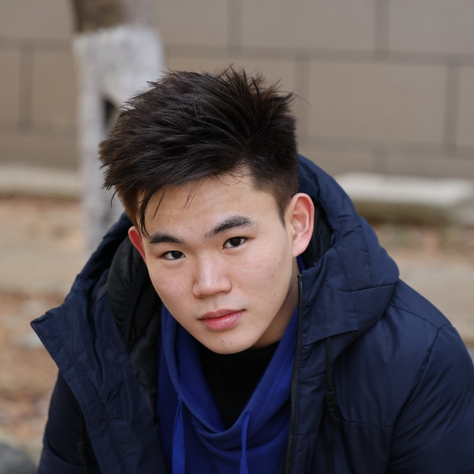
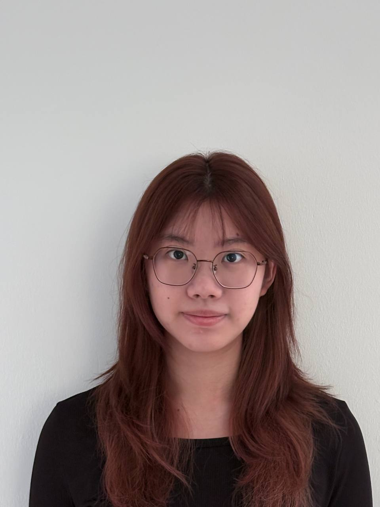
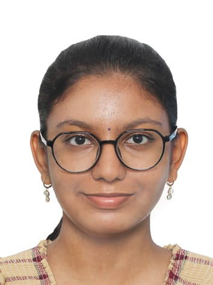

We are a team based in the [School of Computing, National University of Singapore](https://www.comp.nus.edu.sg).

You can reach us at the email `seer[at]comp.nus.edu.sg`

## Project team

### Zhao Zhe Kai, Winston

[[homepage](http://www.comp.nus.edu.sg/~winstonzhaozhekai)]
[[github](https://github.com/winstonzhaozhekai)]
[[portfolio](team/winstonzhaozhekai.md)]

### Liang Ka Hei

[[github](https://github.com/kahei9299)]

* Role: Developer
* Responsibilities: UI

### Lee Yi Xuan

[[github](http://github.com/bobbodi)]

* Role: Developer

### Johnny Doe

[[github](http://github.com/johndoe)] [[portfolio](team/johndoe.md)]

* Role: Developer
* Responsibilities: Data

### Jean Doe

[[github](http://github.com/johndoe)]
[[portfolio](team/johndoe.md)]

* Role: Developer
* Responsibilities: Dev Ops + Threading

### Subhitsha Prabakaran

[[github](https://github.com/subhitsha-sp)]

* Role: Developer
* Responsibilities: Backend
