# CourseBook (v1.5)

## Table of Contents

* [Acknowledgements](#acknowledgements)
* [1. Introduction](#1-introduction)
    * [1.1 About CourseBook](#11-about-coursebook)
    * [1.2 Purpose of this Guide](#12-purpose-of-this-guide)
    * [1.3 Target Audience](#13-target-audience)
* [2. Setting up, getting started](#2-setting-up-getting-started)
* [3. Architecture](#3-architecture)
    * [3.1 High-Level Architecture](#31-high-level-architecture)
    * [3.2 Architectural Patterns and Principles](#32-architectural-patterns-and-principles)
* [4. UI Component](#4-ui-component)
    * [4.1 Structure](#41-structure)
    * [4.2 Technology Stack](#42-technology-stack)
    * [4.3 Responsibilities](#43-responsibilities)
    * [4.4 Key Interactions](#44-key-interactions)
    * [4.5 Theming](#45-theming)
* [5. Logic Component](#5-logic-component)
    * [5.1 Structure](#51-structure)
    * [5.2 Command Execution Lifecycle](#52-command-execution-lifecycle)
    * [5.3 How the Logic Component Works](#53-how-the-logic-component-works)
    * [5.4 Parsing Architecture](#54-parsing-architecture)
    * [5.5 Command Classes](#55-command-classes)
    * [5.6 Argument Parsing Infrastructure](#56-argument-parsing-infrastructure)
    * [5.7 Design Rationale](#57-design-rationale)
* [6. Model Component](#6-model-component)
    * [6.1 Structure and Responsibilities](#61-structure-and-responsibilities)
    * [6.2 Data Model](#62-data-model)
    * [6.3 Alternative Model Design](#63-alternative-model-design)
    * [6.4 Undo/Redo Implementation](#64-undoredo-implementation)
    * [6.5 Undo/Redo Example Usage Scenario](#65-undoredo-example-usage-scenario)
    * [6.6 Undo Sequence Diagram (Logic Layer)](#66-undo-sequence-diagram-logic-layer)
    * [6.7 Undo Sequence Diagram (Model Layer)](#67-undo-sequence-diagram-model-layer)
    * [6.8 Redo](#68-redo)
    * [6.9 Design Considerations for Undo/Redo](#69-design-considerations-for-undoredo)
    * [6.10 Filtering and Sorting](#610-filtering-and-sorting)
* [7. Storage Component](#7-storage-component)
    * [7.1 Structure and Responsibilities](#71-structure-and-responsibilities)
    * [7.2 JSON Serialization](#72-json-serialization)
    * [7.3 JSON Adapter Classes](#73-json-adapter-classes)
    * [7.4 Data Loading and Saving Flow](#74-data-loading-and-saving-flow)
    * [7.5 Error Handling and Data Integrity](#75-error-handling-and-data-integrity)
    * [7.6 File Paths and Configuration](#76-file-paths-and-configuration)
    * [7.7 Design Rationale](#77-design-rationale)
* [8. Common Classes](#8-common-classes)
    * [8.1 Commons Core](#81-commons-core)
    * [8.2 Commons Exceptions](#82-commons-exceptions)
    * [8.3 Commons Utilities](#83-commons-utilities)
* [9. Implementation Details](#9-implementation-details)
    * [9.1 Course Color Management](#91-course-color-management)
    * [9.2 Delete Confirmation Dialog](#92-delete-confirmation-dialog)
    * [9.3 Theme Persistence in Undo/Redo](#93-theme-persistence-in-undoredo)
    * [9.4 Birthday Sorting](#94-birthday-sorting)
    * [9.5 Favorite Status Preservation](#95-favorite-status-preservation)
* [10. Testing](#10-testing)
    * [10.1 Testing Philosophy](#101-testing-philosophy)
    * [10.2 Test Structure](#102-test-structure)
    * [10.3 Running Tests](#103-running-tests)
    * [10.4 Unit Tests](#104-unit-tests)
    * [10.5 Integration Tests](#105-integration-tests)
    * [10.6 System Tests (Manual)](#106-system-tests-manual)
    * [10.7 Test Utilities](#107-test-utilities)
    * [10.8 Continuous Integration](#108-continuous-integration)
* [11. Logging](#11-logging)
    * [11.1 Logging Infrastructure](#111-logging-infrastructure)
    * [11.2 Log Output](#112-log-output)
    * [11.3 Using Logs](#113-using-logs)
    * [11.4 Configuration](#114-configuration)
* [12. Configuration](#12-configuration)
* [13. Documentation, logging, testing, configuration, dev-ops](#13-documentation-logging-testing-configuration-dev-ops)
* [14. Appendix: Requirements](#14-appendix-requirements)
    * [14.1 Product Scope](#141-product-scope)
    * [14.2 User Stories](#142-user-stories)
    * [14.3 Use Cases](#143-use-cases)
    * [14.4 Non-Functional Requirements](#144-non-functional-requirements)
    * [14.5 Glossary](#145-glossary)
* [15. Appendix: Instructions for Manual Testing](#15-appendix-instructions-for-manual-testing)
    * [15.1 Launch and Shutdown](#151-launch-and-shutdown)
    * [15.2 Adding a Person](#152-adding-a-person)
    * [15.3 Deleting a Person](#153-deleting-a-person)
    * [15.4 Editing a Person](#154-editing-a-person)
    * [15.5 Finding Persons](#155-finding-persons)
    * [15.6 Adding Courses to a Person](#156-adding-courses-to-a-person)
    * [15.7 Listing by Course](#157-listing-by-course)
    * [15.8 Undo and Redo](#158-undo-and-redo)
    * [15.9 Command History](#159-command-history)
    * [15.10 Changing Theme](#1510-changing-theme)
    * [15.11 Sorting](#1511-sorting)
    * [15.12 Favorites](#1512-favorites)
    * [15.13 Birthday Management](#1513-birthday-management)
    * [15.14 View Person Details](#1514-view-person-details)
    * [15.15 Summary Statistics](#1515-summary-statistics)
    * [15.16 Saving Data](#1516-saving-data)
    * [15.17 Data Persistence](#1517-data-persistence)
* [16. Appendix: Effort](#16-appendix-effort)
    * [16.1 Difficulty Level](#161-difficulty-level)
    * [16.2 Challenges Faced](#162-challenges-faced)
    * [16.3 Effort Comparison to AB3](#163-effort-comparison-to-ab3)
    * [16.4 Achievements](#164-achievements)
    * [16.5 Effort Summary](#165-effort-summary)
* [17. Appendix: Planned Enhancements](#17-appendix-planned-enhancements)
* [18. Summary](#18-summary)


---

## **Acknowledgements**

- The features undo and redo were inspired by similar features of the SE-EDU Address Book (Level 4) https://se-education.org/addressbook-level4/
- CourseBook is built upon the AddressBook-Level3 (AB3) foundation created by the [SE-EDU initiative](https://se-education.org)

---

## **1. Introduction**

### 1.1 About CourseBook

**CourseBook** is a desktop application designed for university students to efficiently manage their academic network by organizing contacts based on shared courses. It combines the efficiency of a **Command Line Interface (CLI)** with the intuitiveness of a **Graphical User Interface (GUI)**, making it ideal for fast typists who want quick access to their academic contacts.

**Key Features:**
- Organize contacts by course enrollment
- Manage favorites for quick access to close friends
- Search across multiple contact fields
- Track birthdays and sort by upcoming birthdays
- Color-code courses for visual clarity
- Comprehensive undo/redo functionality
- Customizable themes

### 1.2 Purpose of this Guide

This Developer Guide provides comprehensive documentation for developers who wish to:
- **Understand** the architecture and design decisions behind CourseBook
- **Contribute** new features or enhancements
- **Maintain** and debug the existing codebase
- **Extend** the application for custom use cases

### 1.3 Target Audience

This guide is intended for:
- **Software Engineers** working on CourseBook
- **Module Tutors** evaluating the project design
- **Contributors** from the open-source community
- **Students** learning software architecture patterns

---

## **2. Setting up, getting started**

Refer to the guide [_Setting up and getting started_](SettingUp.md).

---

## **3. Architecture**

<div markdown="span" class="alert alert-primary">

:bulb: **Tip:** The `.puml` files used to create diagrams in this document are in the `docs/diagrams` folder. Refer to the [_PlantUML Tutorial_ at se-edu/guides](https://se-education.org/guides/tutorials/plantUml.html) to learn how to create and edit diagrams.

</div>

### 3.1 High-Level Architecture


*Figure 1: The above diagram shows the high-level design of CourseBook with five main components: Main, UI, Logic, Model, Storage, and Commons*

The **Architecture Diagram** above explains the high-level design of the application. CourseBook follows a **4-layer architecture** with a shared **Commons** component containing utility classes used across layers.

**Main components of the architecture**

**`Main`** (consisting of classes [`Main`](https://github.com/AY2526S1-CS2103T-F10-2/tp/tree/master/src/main/java/seedu/coursebook/Main.java) and [`MainApp`](https://github.com/AY2526S1-CS2103T-F10-2/tp/tree/master/src/main/java/seedu/coursebook/MainApp.java)) is responsible for application launch and shutdown.

- At app launch, it initializes the other components in the correct sequence and connects them.
- At shutdown, it saves user preferences and shuts down the other components.

The four main functional components are:

- [**`UI`**](#4-ui-component): The User Interface component that renders the GUI and receives user input.
- [**`Logic`**](#5-logic-component): The command executor that parses and executes user commands.
- [**`Model`**](#6-model-component): Holds application data in memory and manages state.
- [**`Storage`**](#7-storage-component): Reads data from and writes data to persistent storage (JSON files).

[**`Commons`**](#8-common-classes) represents a collection of classes used by multiple other components, including logging, configuration management, and utility functions.

**How the architecture components interact with each other**

The _Sequence Diagram_ below shows how the components interact with each other for the scenario where the user issues the command `delete 1`.

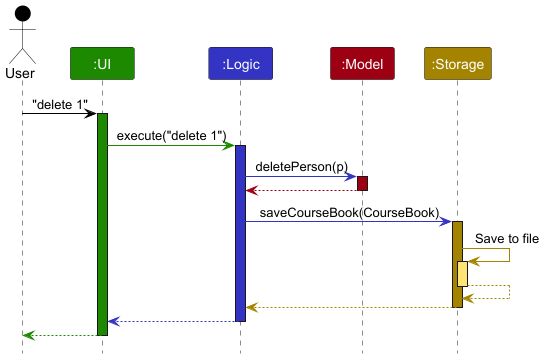

*Figure 2: Shows inter-component interactions for `delete 1` command*

Each of the four main components:

- Defines its _API_ in an `interface` with the same name as the component.
- Implements its functionality using a concrete `{Component Name}Manager` class (which implements the corresponding API `interface`).

For example, the `Logic` component defines its API in the [Logic.java](https://github.com/AY2526S1-CS2103T-F10-2/tp/tree/master/src/main/java/seedu/coursebook/logic/Logic.java) interface and implements its functionality using the [LogicManager.java](https://github.com/AY2526S1-CS2103T-F10-2/tp/tree/master/src/main/java/seedu/coursebook/logic/LogicManager.java) class which implements the `Logic` interface. Other components interact with a given component through its interface rather than the concrete class (reason: to prevent outside components from being coupled to the implementation of a component), as illustrated in the (partial) class diagram below.


*Figure 14: Shows the interface-implementation pattern for component managers*

The sections below give more details of each component.

### 3.2 Architectural Patterns and Principles

CourseBook employs several key architectural patterns:

**1. Layered Architecture**
- Clear separation between UI, Logic, Model, and Storage layers
- Each layer depends only on the layers below it
- Changes to one layer have minimal impact on others

**2. Dependency Inversion Principle (DIP)**
- Components depend on abstractions (interfaces) rather than concrete implementations
- Example: `LogicManager` depends on the `Model` interface, not `ModelManager`

**3. Single Responsibility Principle (SRP)**
- Each component has a single, well-defined responsibility
- Example: `Storage` handles only persistence, not business logic

**4. Command Pattern**
- All user actions are represented as `Command` objects
- Enables undo/redo functionality and command history

**5. Observer Pattern**
- UI components observe Model changes through JavaFX `ObservableList`
- Automatic UI updates when data changes

**Design Rationale:**
These patterns enable maintainability, testability, and extensibility. The layered architecture with dependency inversion allows components to be tested independently and replaced without affecting other parts of the system.

---

## **4. UI Component**

**API**: [`Ui.java`](https://github.com/AY2526S1-CS2103T-F10-2/tp/tree/master/src/main/java/seedu/coursebook/ui/Ui.java)

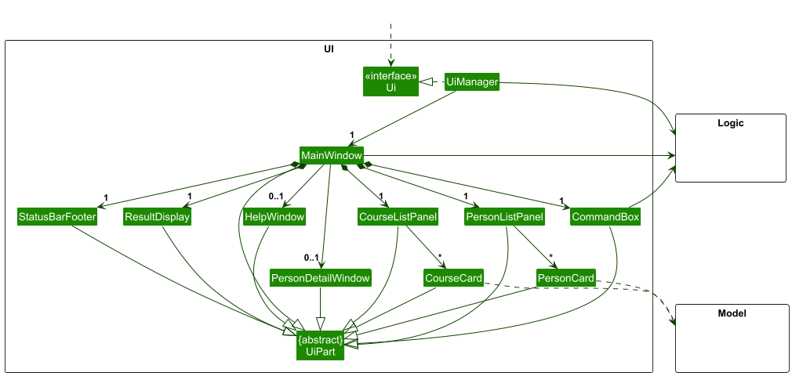

*Figure 4: Shows the structure of UI components including MainWindow, PersonListPanel, CourseListPanel, CommandBox, ResultDisplay, etc.*

### 4.1 Structure

The UI consists of a `MainWindow` that is made up of several parts:
- `CommandBox` - Text input field for user commands
- `ResultDisplay` - Shows command execution results and feedback
- `PersonListPanel` - Displays the list of persons (contains multiple `PersonCard` objects)
- `CourseListPanel` - Displays the list of courses (contains multiple `CourseCard` objects)
- `StatusBarFooter` - Shows the data file path
- `HelpWindow` - Displays help information (opened on demand)
- `PersonDetailWindow` - Shows detailed information for a specific person (opened on demand)

All these UI parts, including the `MainWindow`, inherit from the abstract `UiPart` class which captures the commonalities between classes that represent parts of the visible GUI.

### 4.2 Technology Stack

The `UI` component uses the **JavaFX UI framework**. The layout of these UI parts is defined in matching `.fxml` files located in the `src/main/resources/view` folder. For example, the layout of the [`MainWindow`](https://github.com/AY2526S1-CS2103T-F10-2/tp/tree/master/src/main/java/seedu/coursebook/ui/MainWindow.java) is specified in [`MainWindow.fxml`](https://github.com/AY2526S1-CS2103T-F10-2/tp/tree/master/src/main/resources/view/MainWindow.fxml).

### 4.3 Responsibilities

The `UI` component:

- Executes user commands using the `Logic` component
- Listens for changes to `Model` data so that the UI can be updated with the modified data automatically
- Keeps a reference to the `Logic` component because the `UI` relies on the `Logic` to execute commands
- Depends on some classes in the `Model` component, as it displays `Person` and `Course` objects residing in the `Model`

### 4.4 Key Interactions

**Command Execution Flow:**
1. User types a command in `CommandBox` and presses Enter
2. `CommandBox` passes the command text to `Logic.execute()`
3. `Logic` returns a `CommandResult` object
4. `ResultDisplay` shows the feedback message from `CommandResult`
5. If `CommandResult` contains flags (e.g., `showHelp`, `showPersonDetail`), appropriate windows are opened

**Data Binding:**
- `PersonListPanel` is bound to `Logic.getFilteredPersonList()` (an `ObservableList<Person>`)
- `CourseListPanel` is bound to `Logic.getFilteredCourseList()` (an `ObservableList<Course>`)
- When the Model updates these lists, the UI automatically refreshes

### 4.5 Theming

CourseBook supports multiple themes:
- **Dark** (default) - `DarkTheme.css`
- **Blue** - `BlueTheme.css`
- **Love** - `LoveTheme.css`
- **Tree** - `TreeTheme.css`

Each theme consists of:
- A main stylesheet (e.g., `DarkTheme.css`)
- An extensions file (e.g., `Extensions.css` or `BlueExtensions.css`)

The `theme` command triggers a theme change by updating the `CommandResult` with the new CSS file paths, which `MainWindow` applies dynamically.

---

## **5. Logic Component**

**API**: [`Logic.java`](https://github.com/AY2526S1-CS2103T-F10-2/tp/tree/master/src/main/java/seedu/coursebook/logic/Logic.java)

### 5.1 Structure

Here's a (partial) class diagram of the `Logic` component:


*Figure 5: Shows LogicManager, CourseBookParser, Command hierarchy, and parser classes*

### 5.2 Command Execution Lifecycle

The sequence diagram below illustrates the interactions within the `Logic` component for the API call `execute("delete 1")`.


*Figure 6: Shows the detailed flow from parsing to execution for a delete command*

<div markdown="span" class="alert alert-info">:information_source: **Note:** The lifeline for `DeleteCommandParser` should end at the destroy marker (X) but due to a limitation of PlantUML, the lifeline continues till the end of diagram.
</div>

### 5.3 How the `Logic` Component Works

**Step-by-Step Execution:**

1. **User Input Reception:** When `Logic` is called upon to execute a command, it receives a command string (e.g., `"delete 1"`).

2. **Command Parsing:** The string is passed to a `CourseBookParser` object which:
   - Tokenizes the input to identify the command word (e.g., `"delete"`)
   - Creates the appropriate command-specific parser (e.g., `DeleteCommandParser`)
   - The specific parser parses the arguments and creates a `Command` object (e.g., `DeleteCommand`)

3. **Command Execution:** The `Command` object is executed by `LogicManager`:
   - `command.execute(model, history)` is called
   - The command interacts with the `Model` to perform its action (e.g., delete a person)
   - Note: In the code, this may involve multiple interactions with the Model

4. **Result Encapsulation:** The result of the command execution is encapsulated as a `CommandResult` object which contains:
   - Feedback message to display to the user
   - Flags indicating required UI actions (e.g., `showHelp`, `exit`, `showPersonDetail`)
   - Theme CSS file paths (if theme was changed)

5. **Persistence:** If the Model was modified during execution, `LogicManager` automatically saves the data to `Storage`.

6. **Command History:** The command text is added to `CommandHistory` for later retrieval via the `history` command.

### 5.4 Parsing Architecture

Here are the classes in `Logic` used for parsing a user command:

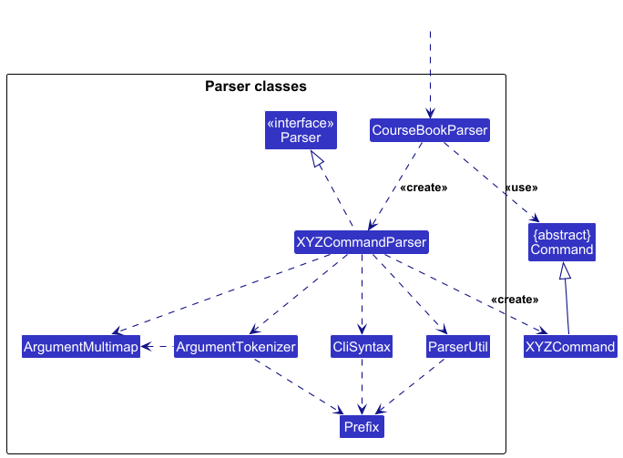

*Figure 7: Shows the parser hierarchy and how CourseBookParser dispatches to specific command parsers*

**How Parsing Works:**

- When called upon to parse a user command, the `CourseBookParser` class:
  1. Uses `ArgumentTokenizer` to split the command into a command word and argument string
  2. Creates an `XYZCommandParser` based on the command word (e.g., `AddCommandParser` for `add`)
  3. The `XYZCommandParser` uses `ArgumentMultimap` and `ParserUtil` to extract and validate arguments
  4. Creates and returns an `XYZCommand` object (e.g., `AddCommand`)

- All `XYZCommandParser` classes (e.g., `AddCommandParser`, `DeleteCommandParser`) inherit from the `Parser` interface so that they can be treated similarly where possible (e.g., during testing).

### 5.5 Command Classes

CourseBook implements **27 command classes** following the Command Pattern:

**Person Management:**
- `AddCommand` - Add new contact
- `EditCommand` - Edit existing contact details
- `DeleteCommand` - Delete one or more contacts
- `ListCommand` - List all persons
- `FindCommand` - Search persons by keywords
- `ViewPersonCommand` - Show detailed person information
- `FavouriteCommand`, `UnfavouriteCommand`, `FavCommand` - Manage favorites
- `BirthdayCommand` - Add/update birthday
- `SortCommand`, `SortBirthdayCommand` - Sort persons

**Course Management:**
- `AddCourseCommand` - Add courses to a person
- `RemoveCourseCommand` - Remove courses from a person
- `EditCourseColorCommand` - Change course color globally
- `ListCoursesCommand` - List all courses
- `ListByCourseCommand` - Filter persons by course

**Application Commands:**
- `ClearCommand` - Clear all data
- `ExitCommand` - Exit application
- `HelpCommand` - Show help
- `HistoryCommand` - Show command history
- `HomeCommand` - Navigate to home view
- `SummaryCommand` - Display summary statistics
- `ThemeCommand` - Change theme
- `UndoCommand`, `RedoCommand` - Undo/redo operations
- `ConfirmDeleteCommand` - Confirm deletion (internal use)

### 5.6 Argument Parsing Infrastructure

**Key Classes:**

- **`CliSyntax`**: Defines prefix constants (e.g., `PREFIX_NAME = new Prefix("n/")`, `PREFIX_PHONE = new Prefix("p/")`)
- **`ArgumentTokenizer`**: Splits arguments string by prefixes (e.g., `"n/John p/91234567"` → map of `{n/ -> "John", p/ -> "91234567"}`)
- **`ArgumentMultimap`**: Maps prefixes to their values, supports multiple values per prefix
- **`ParserUtil`**: Contains static utility methods for parsing and validating specific types (e.g., `parseIndex()`, `parseName()`, `parsePhone()`)

**Example - Parsing `add n/John p/91234567 e/john@example.com a/123 Main St`:**

1. `CourseBookParser` identifies command word `"add"`
2. Creates `AddCommandParser`, passes arguments string `"n/John p/91234567 e/john@example.com a/123 Main St"`
3. `AddCommandParser` uses `ArgumentTokenizer.tokenize()` to create `ArgumentMultimap`
4. Calls `ParserUtil.parseName(argMultimap.getValue(PREFIX_NAME))` → returns `Name` object
5. Similarly parses phone, email, address, tags, courses
6. Creates and returns `AddCommand(name, phone, email, address, tags, courses)`

### 5.7 Design Rationale

**Why Command Pattern?**
- **Undo/Redo:** Each command can be stored in history and reversed
- **Testability:** Commands can be tested in isolation
- **Extensibility:** Adding new commands doesn't require changes to existing code

**Why Separate Parsers?**
- **Single Responsibility:** Each parser handles one command type
- **Maintainability:** Changes to command syntax affect only one parser
- **Reusability:** Common parsing logic is extracted to `ParserUtil`

---

## **6. Model Component**

**API**: [`Model.java`](https://github.com/AY2526S1-CS2103T-F10-2/tp/tree/master/src/main/java/seedu/coursebook/model/Model.java)

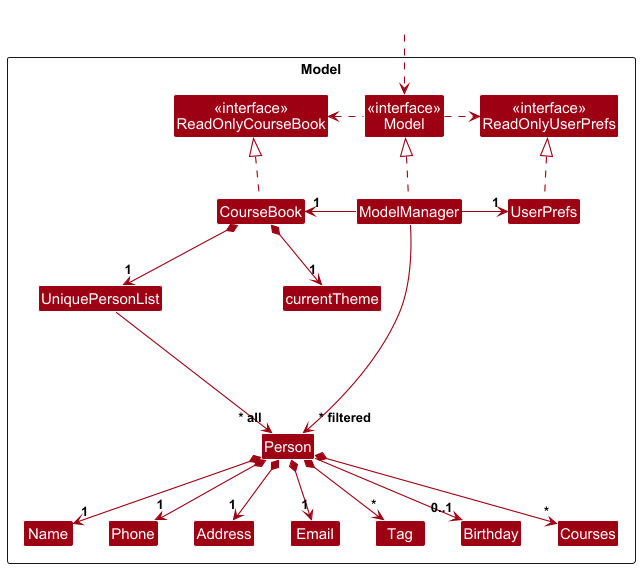

*Figure 8: Shows ModelManager, CourseBook, VersionedCourseBook, Person, Course, Tag, UniquePersonList, and their relationships*

### 6.1 Structure and Responsibilities

The `Model` component:

- Stores the address book data in memory (all `Person` objects are contained in a `UniquePersonList` object within `CourseBook`)
- Stores the currently 'selected' `Person` objects (e.g., results of a search query) as a separate _filtered_ list which is exposed to outsiders as an unmodifiable `ObservableList<Person>` that can be 'observed' (the UI is bound to this list so that the UI automatically updates when the data in the list changes)
- Stores a `UserPrefs` object that represents the user's preferences (file paths, GUI settings, theme). This is exposed to the outside as a `ReadOnlyUserPrefs` object.
- Does not depend on any of the other three components (as the `Model` represents data entities of the domain, they should make sense on their own without depending on other components)
- Manages undo/redo history through `VersionedCourseBook`
- Maintains a dynamically updated `ObservableList<Course>` derived from all persons' course enrollments

### 6.2 Data Model

**Person Entity:**

A `Person` object consists of:
- `Name` (required, alphanumeric + spaces)
- `Phone` (required, 7-15 digits)
- `Email` (required, valid email format)
- `Address` (required, non-empty string)
- `Set<Tag>` (optional, 0 or more tags)
- `Set<Course>` (optional, 0 or more courses)
- `Birthday` (optional, format: dd-MM-yyyy)
- `isFavourite` (boolean flag)

**Uniqueness Constraint:** No two persons can have the same name (case-insensitive, whitespace-normalized) OR the same phone OR the same email.

**Course Entity:**

A `Course` object consists of:
- `courseCode` (required, alphanumeric + hyphens, uppercase)
- `CourseColor` (enum: GREEN, BLUE, RED, ORANGE, PINK, PURPLE, GRAY, YELLOW)

**Tag Entity:**

A `Tag` is a simple label with a `tagName` (alphanumeric only).

### 6.3 Alternative Model Design

<div markdown="span" class="alert alert-info">:information_source: **Note:** An alternative (arguably, a more OOP) model is given below. It has a `Tag` list in the `CourseBook`, which `Person` references. This allows `CourseBook` to only require one `Tag` object per unique tag, instead of each `Person` needing their own `Tag` objects.<br>

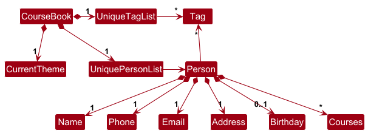


*Figure 9: Shows a design where CourseBook maintains a centralized Tag list referenced by Persons*

</div>

**Current Design (Tag/Course instances per Person):**
- **Pros:** Simpler implementation, easier to serialize/deserialize, no referential integrity concerns
- **Cons:** Duplicate objects in memory (multiple identical `Tag`/`Course` instances)

**Alternative Design (Centralized Tag/Course list):**
- **Pros:** Memory efficient, single source of truth, easier global course color management
- **Cons:** More complex implementation, referential integrity issues, cascading deletions

**Chosen Approach:** CourseBook uses the current design (instances per Person) for Tags but effectively implements a hybrid approach for Courses - each Person has Course instances, but course colors are managed globally through Model methods.

### 6.4 Undo/Redo Implementation

The undo/redo mechanism is facilitated by `VersionedCourseBook`, which extends `CourseBook` with undo/redo history stored internally as a `courseBookStateList` and `currentStatePointer`.

**Key Operations:**

- `VersionedCourseBook#commit()` — Saves the current course book state in its history
- `VersionedCourseBook#undo()` — Restores the previous course book state from its history
- `VersionedCourseBook#redo()` — Restores a previously undone course book state from its history

These operations are exposed in the `Model` interface as `Model#commitCourseBook()`, `Model#undoCourseBook()`, and `Model#redoCourseBook()` respectively.

### 6.5 Undo/Redo Example Usage Scenario

**Step 1. Initial State**
The user launches the application for the first time. The `VersionedCourseBook` will be initialized with the initial course book state, and the `currentStatePointer` pointing to that single course book state.

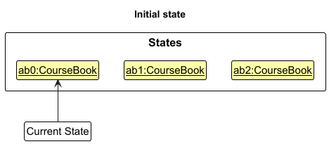

*Figure 10: Shows initial state with one CourseBook snapshot and pointer at index 0*

**Step 2. Delete Command**
The user executes `delete 5` command to delete the 5th person in the course book. The `delete` command calls `Model#commitCourseBook()`, causing the modified state of the course book after the `delete 5` command executes to be saved in the `courseBookStateList`, and the `currentStatePointer` is shifted to the newly inserted state.

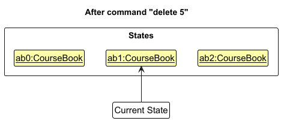

*Figure 11: Shows two states: initial and after delete, pointer at index 1*

**Step 3. Add Command**
The user executes `add n/David …​` to add a new person. The `add` command also calls `Model#commitCourseBook()`, causing another modified course book state to be saved into the `courseBookStateList`.

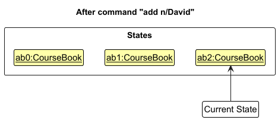

*Figure 12: Shows three states, pointer at index 2*

<div markdown="span" class="alert alert-info">:information_source: **Note:** If a command fails its execution, it will not call `Model#commitCourseBook()`, so the course book state will not be saved into the `courseBookStateList`.
</div>

**Step 4. Undo**
The user now decides that adding the person was a mistake, and decides to undo that action by executing the `undo` command. The `undo` command will call `Model#undoCourseBook()`, which will shift the `currentStatePointer` once to the left, pointing it to the previous course book state, and restores the course book to that state.

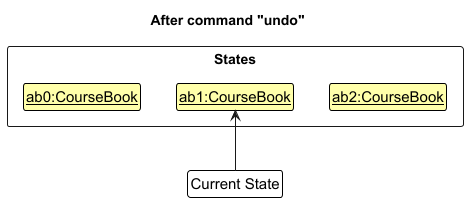

*Figure 13: Shows three states with pointer moved back to index 1*

<div markdown="span" class="alert alert-info">:information_source: **Note:** If the `currentStatePointer` is at index 0, pointing to the initial CourseBook state, then there are no previous CourseBook states to restore. The `undo` command uses `Model#canUndoCourseBook()` to check if this is the case. If so, it will return an error to the user rather than attempting to perform the undo.
</div>

### 6.6 Undo Sequence Diagram (Logic Layer)

The following sequence diagram shows how an undo operation goes through the `Logic` component:

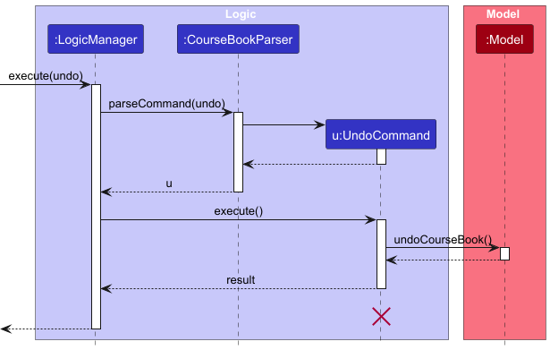

*Figure 14: Shows the flow from UndoCommand through LogicManager and back*

<div markdown="span" class="alert alert-info">:information_source: **Note:** The lifeline for `UndoCommand` should end at the destroy marker (X) but due to a limitation of PlantUML, the lifeline reaches the end of diagram.
</div>

### 6.7 Undo Sequence Diagram (Model Layer)

Similarly, how an undo operation goes through the `Model` component is shown below:

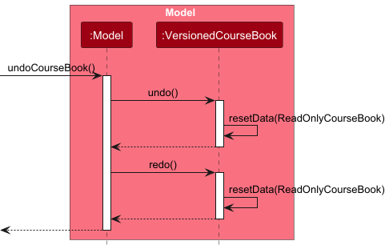

*Figure 15: Shows interactions between ModelManager and VersionedCourseBook during undo*

### 6.8 Redo

The `redo` command does the opposite — it calls `Model#redoCourseBook()`, which shifts the `currentStatePointer` once to the right, pointing to the previously undone state, and restores the course book to that state.

<div markdown="span" class="alert alert-info">:information_source: **Note:** If the `currentStatePointer` is at index `courseBookStateList.size() - 1`, pointing to the latest course book state, then there are no undone CourseBook states to restore. The `redo` command uses `Model#canRedoCourseBook()` to check if this is the case. If so, it will return an error to the user rather than attempting to perform the redo.
</div>

**Step 5. Non-Modifying Command**
The user then decides to execute the command `list`. Commands that do not modify the course book, such as `list`, will usually not call `Model#commitCourseBook()`, `Model#undoCourseBook()`, or `Model#redoCourseBook()`. Thus, the `courseBookStateList` remains unchanged.

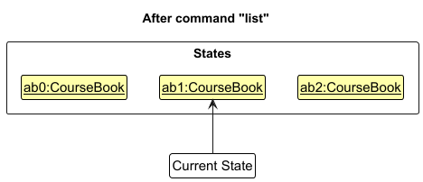

*Figure 16: Shows three states with pointer still at index 1 after list command*

**Step 6. State Branching**
The user executes `clear`, which calls `Model#commitCourseBook()`. Since the `currentStatePointer` is not pointing at the end of the `courseBookStateList`, all course book states after the `currentStatePointer` will be purged. Reason: It no longer makes sense to redo the `add n/David …​` command. This is the behavior that most modern desktop applications follow.

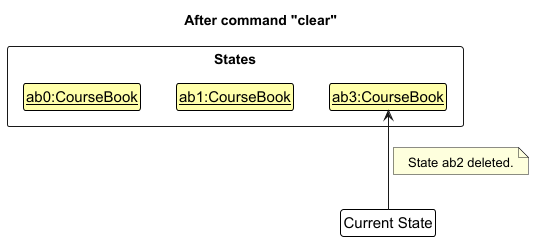

*Figure 17: Shows two states: original and clear state, with the "add David" state purged*

The following activity diagram summarizes what happens when a user executes a new command:

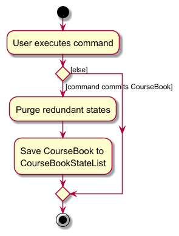

*Figure 18: Shows decision flow: if command modifies data → check if states after pointer exist → purge if yes → add new state*

### 6.9 Design Considerations for Undo/Redo

**Aspect: How undo & redo executes:**

**Alternative 1 (current choice): Saves the entire course book.**
- **Pros:** Easy to implement, guaranteed consistency (entire state snapshot)
- **Cons:** My have performance issues in terms of memory usage (multiple full copies in memory)

**Alternative 2: Individual command undo (Command Pattern with reverse operations).**
- **Pros:** Memory efficient (only store deltas), potentially faster
- **Cons:** Complex implementation, each command needs reverse logic, error-prone (e.g., reversing an edit requires storing old values)

**Rationale:** CourseBook uses Alternative 1 because:
1. **Simplicity:** Easier to implement and maintain
2. **Reliability:** No risk of inconsistent state from failed reverse operations
3. **Acceptable Trade-off:** For typical usage (100-1000 persons), memory overhead is acceptable on modern systems
4. **Course Color Consistency:** Full snapshots preserve global course color mappings correctly

**Enhancement Possibility:** Future versions could implement a hybrid approach where only changed persons are stored with copy-on-write semantics to reduce memory usage while maintaining simplicity.

### 6.10 Filtering and Sorting

**Filtered Lists:**
- `filteredPersons` is a `FilteredList<Person>` wrapper around `versionedCourseBook.getPersonList()`
- Predicates are set via `Model#updateFilteredPersonList(Predicate<Person> predicate)`
- Used by `FindCommand`, `ListByCourseCommand`, `FavCommand`

**Sorting:**
- `Model#sortSelectedPersons(Comparator<Person> comparator)` re-orders the underlying `CourseBook`
- Used by `SortCommand` (sort by name) and `SortBirthdayCommand`
- **Note:** Sorting modifies the model directly (not just a view), so it can be undone

**Course List:**
- `courseList` is dynamically updated by listening to changes in the person list
- Extracts all unique courses from all persons
- Sorted alphabetically by course code

---

## **7. Storage Component**

**API**: [`Storage.java`](https://github.com/AY2526S1-CS2103T-F10-2/tp/tree/master/src/main/java/seedu/coursebook/storage/Storage.java)

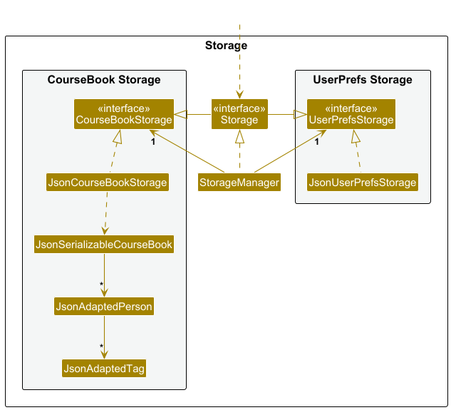

*Figure 19: Shows StorageManager, JsonCourseBookStorage, JsonUserPrefsStorage, and JSON adapter classes*

### 7.1 Structure and Responsibilities

The `Storage` component:

- Can save both address book data and user preference data in JSON format, and read them back into corresponding objects
- Inherits from both `CourseBookStorage` and `UserPrefsStorage`, which means it can be treated as either one (if only the functionality of one is needed)
- Depends on some classes in the `Model` component (because the `Storage` component's job is to save/retrieve objects that belong to the `Model`)

### 7.2 JSON Serialization

**CourseBook Data Structure** (`coursebook.json`):

```json
{
  "persons": [
    {
      "name": "John Doe",
      "phone": "98765432",
      "email": "john@example.com",
      "address": "123 Main St",
      "birthday": "20-02-2000",
      "favourite": true,
      "tagged": ["friend", "classmate"],
      "courses": [
        {"courseCode": "CS2103T", "color": "YELLOW"},
        {"courseCode": "CS2101", "color": "GREEN"}
      ]
    }
  ],
  "theme": "DARK"
}
```

**User Preferences Data Structure** (`preferences.json`):

```json
{
  "guiSettings": {
    "windowWidth": 900.0,
    "windowHeight": 740.0,
    "windowCoordinates": {
      "x": 100,
      "y": 100
    }
  },
  "courseBookFilePath": "data/coursebook.json"
}
```

### 7.3 JSON Adapter Classes

To convert between Java objects and JSON, CourseBook uses **Jackson** library with custom adapter classes:

- `JsonAdaptedPerson` - Converts `Person` ↔ JSON
- `JsonAdaptedCourse` - Converts `Course` ↔ JSON
- `JsonAdaptedTag` - Converts `Tag` ↔ JSON

**Example - JsonAdaptedPerson:**

```java
// Converting Person to JSON
JsonAdaptedPerson jsonPerson = new JsonAdaptedPerson(personObject);
// Jackson serializes jsonPerson to JSON

// Converting JSON to Person
JsonAdaptedPerson jsonPerson = // deserialized from JSON
Person personObject = jsonPerson.toModelType(); // throws IllegalValueException if invalid
```

### 7.4 Data Loading and Saving Flow

**Application Startup (Load):**

1. `MainApp.init()` creates `JsonCourseBookStorage` and `JsonUserPrefsStorage`
2. `StorageManager` wraps both storages
3. `MainApp.initModelManager()` calls `storage.readCourseBook()`
4. `JsonCourseBookStorage.readCourseBook()`:
   - Reads JSON file using Jackson
   - Deserializes to `JsonSerializableCourseBook` (contains list of `JsonAdaptedPerson`)
   - Converts each `JsonAdaptedPerson` to `Person` via `toModelType()`
   - Returns `Optional<ReadOnlyCourseBook>`
5. If file not found or invalid, loads sample data or empty CourseBook

**During Runtime (Save):**

1. User executes command that modifies data (e.g., `add`, `delete`, `edit`)
2. Command calls `model.commitCourseBook()` (for undo/redo)
3. `LogicManager` detects `courseBookModified` flag
4. `LogicManager` calls `storage.saveCourseBook(model.getCourseBook())`
5. `JsonCourseBookStorage.saveCourseBook()`:
   - Converts `CourseBook` to `JsonSerializableCourseBook`
   - Converts each `Person` to `JsonAdaptedPerson`
   - Serializes to JSON file using Jackson

**Application Shutdown:**

1. `MainApp.stop()` saves user preferences via `storage.saveUserPrefs(model.getUserPrefs())`

### 7.5 Error Handling and Data Integrity

**File Not Found:**
- If `coursebook.json` doesn't exist on startup → load sample data (first run experience)
- If `preferences.json` doesn't exist → use default preferences

**Corrupted Data:**
- If JSON is malformed → `DataLoadingException` is thrown → log warning → start with empty CourseBook
- If JSON is valid but data is invalid (e.g., invalid email format) → `IllegalValueException` during `toModelType()` → that person is skipped

**Write Failures:**
- If disk is full or permissions denied → `IOException` → command fails with error message → user can retry

**Data Validation:**
- All data is validated during JSON → Model conversion via `JsonAdaptedPerson.toModelType()`
- Same validation logic as used by parsers (e.g., `Name.isValidName()`, `Email.isValidEmail()`)

### 7.6 File Paths and Configuration

**Default Paths:**
- CourseBook data: `data/coursebook.json`
- User preferences: `preferences.json`
- Application config: `config.json`

**Custom Paths:**
- User can specify custom config file via command line: `java -jar coursebook.jar --config myconfig.json`
- User preferences file path is read from config
- CourseBook file path is read from preferences

**Cross-Platform Compatibility:**
- File paths use `Path` objects (platform-independent)
- Automatic creation of parent directories if they don't exist

### 7.7 Design Rationale

**Why JSON over XML?**
- **Human-readable:** Easier for advanced users to edit manually
- **Compact:** Smaller file size
- **Native Java Support:** Jackson library is mature and widely used

**Why Jackson over Gson?**
- **Flexibility:** Supports complex object graphs
- **Performance:** Faster serialization/deserialization
- **Annotations:** Cleaner code with annotations for custom serialization

**Why Separate Adapters?**
- **Single Responsibility:** Each adapter handles one entity type
- **Testability:** Adapters can be tested independently
- **Flexibility:** Easy to change JSON structure without affecting Model

---

## **8. Common Classes**

Classes used by multiple components are in the `seedu.coursebook.commons` package.

### 8.1 Commons Core

**`Config`**
- Stores application configuration (log level, user prefs file path)
- Loaded from `config.json` on startup

**`LogsCenter`**
- Centralized logging infrastructure
- Provides logger instances to all components
- Log levels: SEVERE, WARNING, INFO, FINE, FINER, FINEST
- Logs to both console and file (`coursebook.log`)

**`GuiSettings`**
- Stores GUI window settings (size, position)
- Persisted in user preferences

**`Version`**
- Represents application version (major.minor.patch + early access flag)
- Current version: `1.4.0` (with early access)

**`Index`**
- Wrapper class for 1-based indices
- Prevents off-by-one errors (internally stores 0-based, exposes 1-based)
- Used throughout Logic and Model for list operations

### 8.2 Commons Exceptions

**`DataLoadingException`**
- Thrown when data files cannot be loaded (missing, corrupted, permission denied)

**`IllegalValueException`**
- Thrown when data validation fails during deserialization (e.g., invalid email format in JSON)

### 8.3 Commons Utilities

**`StringUtil`**
- String manipulation helpers (e.g., `containsWordIgnoreCase()`, `getDetails()` for exception messages)

**`FileUtil`**
- File path validation and operations (e.g., `isValidPath()`, `createIfMissing()`)

**`JsonUtil`**
- JSON serialization/deserialization wrapper around Jackson
- Generic methods: `serializeObjectToJsonFile()`, `deserializeObjectFromJsonFile()`

**`ConfigUtil`**
- Config file read/write operations

**`CollectionUtil`**
- Collection validation helpers (e.g., `requireAllNonNull()`)

**`AppUtil`**
- Application-wide validation utilities (e.g., `checkArgument()`)

---

## **9. Implementation Details**

### 9.1 Course Color Management

**Challenge:** Maintain consistent course colors across all persons while allowing per-course color customization.

**Implementation:**

CourseBook uses a **hybrid approach**:

1. Each `Person` object contains a `Set<Course>`, and each `Course` has a `CourseColor` enum value.
2. When adding a course to a person:
   - **If the course code already exists** in the system (found in another person), the existing color is used (enforced by `AddCommand` and `AddCourseCommand`)
   - **If the course is new**, the user-specified color is used (defaults to GREEN if not specified)
3. `EditCourseColorCommand` changes the color globally:
   - `Model#setCourseColor(String courseCode, CourseColor color)` iterates through all persons
   - Creates updated `Course` objects with the new color
   - Rebuilds the entire `CourseBook` with updated persons
   - Commits the change (enables undo)

**Code Pointer:**
- `ModelManager.java:233-254` - `setCourseColor()` method
- `AddCommand.java` - Course color resolution logic
- `EditCourseColorCommand.java` - Global color update

**Design Rationale:**
- **Pros:** Simple implementation, works with current architecture, supports undo/redo
- **Cons:** O(n) complexity for color updates (n = number of persons)
- **Trade-off:** Acceptable for typical usage (few color changes, ≤1000 persons)

### 9.2 Delete Confirmation Dialog

**Challenge:** Prevent accidental deletions while maintaining CLI efficiency.

**Implementation:**

CourseBook uses a **two-phase deletion** process:

1. **Phase 1 - Prepare:** `DeleteCommand.execute()`:
   - Validates indices/names
   - Identifies persons to be deleted
   - Returns `CommandResult` with `requiresConfirmation = true` and `personsToDelete` list

2. **Phase 2 - Confirm:** User sees dialog via `MainWindow`:
   - If user clicks OK → `ConfirmDeleteCommand` is executed
   - If user clicks Cancel → no action taken

3. **Actual Deletion:** `ConfirmDeleteCommand.execute()`:
   - Deletes persons from model
   - Commits change
   - Returns success message

**Code Pointers:**
- `DeleteCommand.java` - Phase 1 logic
- `ConfirmDeleteCommand.java` - Phase 2 logic
- `MainWindow.java` - Dialog display and ConfirmDeleteCommand invocation

**Design Rationale:**
- **Pros:** Prevents accidental deletions, gives user chance to review
- **Cons:** Requires two steps (less efficient than one-shot delete)
- **Trade-off:** Safety over speed for irreversible operations

### 9.3 Theme Persistence in Undo/Redo

**Challenge:** Theme changes should be undoable, but theme is not part of the `CourseBook` model.

**Implementation:**

1. **Theme Storage:** `CourseBook` has a `currentTheme` field (enum: DARK, BLUE, LOVE, TREE)
2. **Theme Change:** `ThemeCommand.execute()` calls `model.setCurrentTheme()` which:
   - Updates `versionedCourseBook.setCurrentTheme()`
   - Returns `CommandResult` with CSS file paths
   - `MainWindow` applies CSS
   - `ThemeCommand` then calls `model.commitCourseBook()` (saves state for undo)

3. **Undo/Redo with Theme Detection:**
   - `ModelManager.undoCourseBook()` and `redoCourseBook()` detect if theme changed during undo/redo
   - If theme changed, `themeChangedDuringUndo` flag is set
   - `UndoCommand` and `RedoCommand` check this flag
   - If flag is true, `CommandResult` includes theme CSS file paths
   - UI applies the theme

**Code Pointers:**
- `CourseBook.java` - `currentTheme` field
- `VersionedCourseBook.java` - Theme field is part of snapshots
- `ModelManager.java:203-225` - Theme detection during undo/redo
- `UndoCommand.java` and `RedoCommand.java` - Theme CSS handling in CommandResult

**Design Rationale:**
- **Pros:** Theme changes are undoable, consistent with other commands
- **Cons:** Slightly complex logic for detecting theme changes during undo/redo
- **Trade-off:** Consistency (all changes are undoable) over implementation simplicity

### 9.4 Birthday Sorting

**Challenge:** Sort persons by "days until next birthday" (considering current year vs. next year).

**Implementation:**

1. **Birthday Normalization:**
   - For each person, compute their next birthday date
   - If birthday has passed this year → use next year's date
   - If birthday hasn't passed this year → use this year's date

2. **Sorting:**
   - Create a `Comparator<Person>` that compares normalized birthday dates
   - Persons without birthdays are placed at the end

3. **Application:**
   - `SortBirthdayCommand.execute()` calls `model.sortSelectedPersons(comparator)`
   - `ModelManager.sortSelectedPersons()` rebuilds `CourseBook` in sorted order
   - Commits change (enables undo)

**Code Pointers:**
- `SortBirthdayCommand.java` - Comparator logic
- `Birthday.java` - Date parsing and normalization utilities
- `ModelManager.java:173-187` - Sorting implementation

**Design Rationale:**
- **Pros:** Intuitive behavior (upcoming birthdays first), handles year boundaries correctly
- **Cons:** O(n log n) sorting operation
- **Trade-off:** Acceptable performance for typical usage

### 9.5 Favorite Status Preservation

**Challenge:** Favorite status should persist across edits and undo/redo operations.

**Implementation:**

1. **Favorite as Person Field:**
   - `Person` has an `isFavourite` boolean field
   - Immutable like other Person fields

2. **Edit Command:**
   - `EditCommand` does not touch `isFavourite` field
   - `EditPersonDescriptor` doesn't have a favorite field
   - When creating edited person, existing favorite status is preserved

3. **Undo/Redo:**
   - Since `isFavourite` is part of `Person`, it's automatically saved in undo/redo snapshots

**Code Pointers:**
- `Person.java` - `isFavourite` field
- `EditCommand.java` - Favorite preservation logic
- `FavouriteCommand.java` and `UnfavouriteCommand.java` - Set favorite status

**Design Rationale:**
- **Pros:** Simple, consistent with other Person fields
- **Cons:** None
- **Trade-off:** N/A (clear best approach)

---

## **10. Testing**

### 10.1 Testing Philosophy

CourseBook employs a comprehensive testing strategy covering unit tests, integration tests, and system tests. The testing framework is JUnit 5 (Jupiter) with JaCoCo for code coverage reporting.

**Testing Principles:**
1. **Test Independence:** Tests should not depend on each other (no shared state)
2. **Fast Feedback:** Unit tests should run quickly (entire suite in <30 seconds)
3. **Meaningful Assertions:** Assert on expected behavior, not implementation details

### 10.2 Test Structure

```
src/test/java/seedu/coursebook/
├── commons/                  # Commons utility tests
│   ├── core/                 # Config, Version, Index tests
│   └── util/                 # StringUtil, FileUtil tests
├── logic/                    # Logic layer tests
│   ├── commands/             # 24 command test classes
│   ├── parser/               # 13 parser test classes
│   └── LogicManagerTest.java
├── model/                    # Model layer tests
│   ├── person/               # Person, UniquePersonList tests
│   ├── course/               # Course tests
│   └── ModelManagerTest.java
├── storage/                  # Storage layer tests
│   ├── JsonCourseBookStorageTest.java
│   └── JsonUserPrefsStorageTest.java
└── testutil/                 # Test utilities and builders
    ├── TypicalPersons.java   # Standard test data
    ├── PersonBuilder.java    # Fluent API for creating test persons
    └── CourseBookBuilder.java
```

### 10.3 Running Tests

**Run all tests:**
```bash
./gradlew test
```

**Run tests for a specific package:**
```bash
./gradlew test --tests seedu.coursebook.logic.commands.*
```

**Generate code coverage report:**
```bash
./gradlew coverage
# Report generated at build/reports/jacoco/test/html/index.html
```

### 10.4 Unit Tests

**Command Tests:**

Each command class has a corresponding test class that verifies:
- **Success cases:** Command executes correctly with valid inputs
- **Failure cases:** Command throws `CommandException` for invalid states
- **Model interactions:** Correct methods are called on Model
- **Equivalence partitioning:** Boundary values, null values, empty strings

**Example - AddCommandTest.java:**
```java
@Test
public void execute_newPerson_success() {
    Person validPerson = new PersonBuilder().build();
    Model model = new ModelManager();

    CommandResult result = new AddCommand(validPerson).execute(model);

    assertEquals(String.format(AddCommand.MESSAGE_SUCCESS, validPerson),
                 result.getFeedbackToUser());
    assertEquals(validPerson, model.getFilteredPersonList().get(0));
}

@Test
public void execute_duplicatePerson_throwsCommandException() {
    Person person = new PersonBuilder().build();
    Model model = new ModelManager();
    model.addPerson(person);

    assertThrows(CommandException.class, () ->
        new AddCommand(person).execute(model));
}
```

**Parser Tests:**

Each parser class is tested for:
- **Valid inputs:** Correct Command object is created
- **Invalid inputs:** `ParseException` is thrown
- **Missing required fields:** Appropriate error messages
- **Invalid field formats:** Appropriate validation errors

**Example - AddCommandParserTest.java:**
```java
@Test
public void parse_allFieldsPresent_success() {
    String userInput = " n/John p/91234567 e/john@example.com a/123 Main St";

    AddCommand command = new AddCommandParser().parse(userInput);

    assertEquals(new AddCommand(/* expected person */), command);
}

@Test
public void parse_missingName_throwsParseException() {
    String userInput = " p/91234567 e/john@example.com a/123 Main St";

    assertThrows(ParseException.class, () ->
        new AddCommandParser().parse(userInput));
}
```

### 10.5 Integration Tests

**AddCommandIntegrationTest:**

Tests the interaction between `AddCommand`, `Model`, and `Storage`:
```java
@Test
public void execute_newPerson_addedToModelAndStorage() throws Exception {
    Model model = new ModelManager();
    Storage storage = new StorageManager(/* temp file paths */);
    Logic logic = new LogicManager(model, storage);

    logic.execute("add n/John p/91234567 e/john@example.com a/123 Main St");

    // Verify model updated
    assertEquals(1, model.getFilteredPersonList().size());

    // Verify storage file updated
    Optional<ReadOnlyCourseBook> savedData = storage.readCourseBook();
    assertTrue(savedData.isPresent());
    assertEquals(1, savedData.get().getPersonList().size());
}
```

**LogicManagerTest:**

Tests the full command execution pipeline:
- Command parsing
- Command execution
- Model updates
- Storage persistence
- CommandResult generation

### 10.6 System Tests (Manual)

Refer to [Testing guide](Testing.md) and [User Guide - Manual Testing](UserGuide.md#appendix-instructions-for-manual-testing) for system test cases.

**Key System Test Scenarios:**
- Launch and shutdown
- Data persistence across sessions
- Invalid data file handling
- Undo/redo across multiple commands
- Theme persistence
- Large dataset performance (1000 persons)

### 10.7 Test Utilities

**TypicalPersons.java:**

Provides standard test data:
```java
public class TypicalPersons {
    public static final Person ALICE = new PersonBuilder()
        .withName("Alice Pauline")
        .withPhone("94351253")
        .withEmail("alice@example.com")
        .withAddress("123, Jurong West Ave 6")
        .withTags("friends")
        .withCourses("CS2103T,YELLOW")
        .build();

    // ... more typical persons ...

    public static CourseBook getTypicalCourseBook() {
        CourseBook cb = new CourseBook();
        cb.addPerson(ALICE);
        cb.addPerson(BENSON);
        // ... add all typical persons ...
        return cb;
    }
}
```

**PersonBuilder.java:**

Fluent API for creating test persons:
```java
Person person = new PersonBuilder()
    .withName("John Doe")
    .withPhone("91234567")
    .withEmail("john@example.com")
    .withAddress("123 Main St")
    .withTags("friend", "classmate")
    .withCourses("CS2103T,YELLOW", "CS2101,BLUE")
    .withBirthday("20-02-2000")
    .withFavourite(true)
    .build();
```

### 10.8 Continuous Integration

CourseBook uses **GitHub Actions** for CI:
- Runs all tests on every push and pull request
- Checks code style with Checkstyle
- Generates code coverage reports
- Uploads coverage to Codecov
- Fails build if tests fail or coverage drops below threshold

**CI Configuration:** `.github/workflows/gradle.yml`

---

## **11. Logging**

### 11.1 Logging Infrastructure

CourseBook uses **`java.util.logging`** package through a centralized `LogsCenter` class.

**Log Levels (highest to lowest severity):**
- `SEVERE` - Critical errors that prevent functionality
- `WARNING` - Recoverable errors or unexpected situations
- `INFO` - Key application events (startup, shutdown, user commands)
- `FINE` - Detailed tracing for debugging
- `FINER` - Very detailed tracing
- `FINEST` - Extremely detailed tracing

### 11.2 Log Output

**Console Output:**
- Only `INFO` and above are logged to console by default
- Configurable via `config.json`

**File Output:**
- All levels logged to `coursebook.log`
- File is created in the same directory as the JAR file
- Rotated when it exceeds 5MB

### 11.3 Using Logs

**Obtaining a Logger:**
```java
import seedu.coursebook.commons.core.LogsCenter;

public class MyClass {
    private static final Logger logger = LogsCenter.getLogger(MyClass.class);

    public void myMethod() {
        logger.info("Executing myMethod");
        logger.fine("Detailed information: " + details);
    }
}
```

**Logging Best Practices:**
- Log user commands at `INFO` level (see `LogicManager.java:57`)
- Log data loading/saving at `INFO` level
- Log warnings for data corruption or recoverable errors
- Log severe errors for unrecoverable errors
- Avoid logging sensitive data (passwords, etc.)
- Use appropriate log levels (don't log everything at `INFO`)

### 11.4 Configuration

Log level is configured in `config.json`:
```json
{
  "logLevel": "INFO"
}
```

---

## **12. Configuration**

Refer to the guide [_Configuration guide_](Configuration.md).

**Key Configuration Files:**

- **`config.json`** - Application config (log level, user prefs path)
- **`preferences.json`** - User preferences (window size, theme, data file path)
- **`coursebook.json`** - Data file (persons, courses)

---

## **13. Documentation, logging, testing, configuration, dev-ops**

- [Documentation guide](Documentation.md)
- [Testing guide](Testing.md)
- [Logging guide](Logging.md)
- [Configuration guide](Configuration.md)
- [DevOps guide](DevOps.md)

---

## **14. Appendix: Requirements**

### 14.1 Product Scope

**Target user profile:**

* Is a university student
* Has a need to manage a significant number of academic contacts (classmates, professors, TAs)
* Takes multiple courses/modules each semester
* Wants to easily identify and connect with classmates in specific courses
* Prefers desktop apps over other types
* Can type fast
* Prefers typing to mouse interactions
* Is reasonably comfortable using CLI apps
* Values quick access to course-related contact information
* Seeks academic collaboration and support from peers

**Value proposition:**

CourseBook helps university students efficiently manage and organize their academic contacts by course affiliation, making it easy to identify classmates, access instructor information, and foster academic collaboration within specific modules. It is faster than typical mouse-driven GUI apps for users who can type fast.

### 14.2 User Stories

Priorities: High (must have) - `* * *`, Medium (nice to have) - `* *`, Low (unlikely to have) - `*`

| Priority | As a …​                                    | I want to …​                                   | So that I can…​                                                        |
|----------|--------------------------------------------|------------------------------------------------|------------------------------------------------------------------------|
| `* * *`  | user                                       | launch coursebook from my laptop               | use it                                                                 |
| `* * *`  | new user                                   | see usage instructions                         | refer to instructions when I forget how to use the App                 |
| `* * *`  | user                                       | add a new person                               | keep track of my academic contacts                                     |
| `* * *`  | user                                       | delete a person                                | remove entries that I no longer need                                   |
| `* * *`  | user                                       | edit a contact                                 | keep contact information up to date                                    |
| `* * *`  | user                                       | input all the courses that I am taking         | identify friends taking the same courses as me                         |
| `* * *`  | user                                       | view contacts by course                        | easily find classmates for specific modules                            |
| `* * *`  | user                                       | list all my contacts                           | see everyone in my address book                                        |
| `* * *`  | user                                       | find contacts by name or keyword               | quickly locate specific persons                                        |
| `* *`    | time-conscious user                        | search for friends by multiple fields          | find a person quickly even with partial information                    |
| `* *`    | user                                       | see my friends who have common courses with me | identify and contact them for study groups or collaboration            |
| `* *`    | user                                       | differentiate courses by colours               | visually identify which courses my friends take easily                 |
| `* *`    | user with many persons in the course book  | keep a list of favourite contacts              | find my close friends easily                                           |
| `* *`    | user                                       | add birthdays to contacts                      | remember and celebrate friends' birthdays                              |
| `* *`    | user                                       | sort contacts by name                          | find people alphabetically                                             |
| `* *`    | user                                       | sort contacts by upcoming birthdays            | see whose birthday is coming up soon                                   |
| `* *`    | user                                       | undo my last action                            | revert mistakes quickly                                                |
| `* *`    | user                                       | redo an undone action                          | restore changes if I undid by mistake                                  |
| `* *`    | user                                       | view command history                           | recall what commands I ran recently                                    |
| `* *`    | user                                       | see a summary of my contacts and courses       | get an overview of my network                                          |
| `* *`    | user                                       | change the application theme                   | customize the appearance to my preference                              |
| `* *`    | user                                       | view detailed information about a person       | see all their details in one place                                     |
| `*`      | user                                       | export course contact lists                    | share them with study group members                                    |
| `*`      | user                                       | import contacts from a file                    | quickly populate my address book                                       |

### 14.3 Use Cases

(For all use cases below, the **System** is the `CourseBook` and the **Actor** is the `user`, unless specified otherwise)

#### Use Case: UC01 - Add a Contact

**MSS**

1. User enters command to add a new person with name, phone, email, address, and optionally tags/courses.
2. CourseBook validates all fields.
3. CourseBook checks for duplicates (by name/email/phone).
4. CourseBook adds the contact to in-memory data.
5. CourseBook updates the UI to show the new contact.
6. CourseBook persists the change to the JSON file.
7. CourseBook displays success message.

   Use case ends.

**Extensions**

- 1a. Missing required fields (name, phone, email, or address):
  - 1a1. CourseBook shows error: "Invalid command format!"
  - Use case ends.

- 2a. Invalid field format (e.g., non-numeric phone, invalid email):
  - 2a1. CourseBook shows field-specific error message.
  - Use case resumes at step 1.

- 3a. Duplicate name, email, or phone exists:
  - 3a1. CourseBook shows: "This person already exists in the address book."
  - Use case ends.

#### Use Case: UC02 - Delete a Contact

**MSS**

1. User requests to list persons (UC03) or find persons (UC05).
2. CourseBook shows a list of persons.
3. User requests to delete a specific person by index or name.
4. CourseBook displays a confirmation dialog with the person(s) to be deleted.
5. User confirms deletion.
6. CourseBook deletes the person.
7. CourseBook updates the UI.
8. CourseBook persists the change.
9. CourseBook displays success message.

   Use case ends.

**Extensions**

- 2a. The list is empty:
  - Use case ends.

- 3a. The given index is invalid:
  - 3a1. CourseBook shows an error message.
  - Use case resumes at step 2.

- 3b. The given name does not match any contact:
  - 3b1. CourseBook shows "No such contact found!"
  - Use case resumes at step 2.

- 3c. The given name matches multiple contacts:
  - 3c1. CourseBook shows "Multiple contacts found with that name. Please delete by index."
  - Use case resumes at step 2.

- 5a. User cancels deletion:
  - Use case ends.

#### Use Case: UC03 - List All Contacts

**MSS**

1. User enters `list` command.
2. CourseBook displays all contacts in the person list panel.

   Use case ends.

**Extensions**

- 1a. No contacts exist:
  - 1a1. CourseBook shows an empty list.
  - Use case ends.

#### Use Case: UC04 - List Contacts by Course

**MSS**

1. User enters command to list contacts by a specific course code.
2. CourseBook normalizes the course code (trim + uppercase).
3. CourseBook finds all contacts enrolled in that course.
4. CourseBook displays the matching contacts in the person list panel.

   Use case ends.

**Extensions**

- 1a. Missing course code:
  - 1a1. CourseBook shows error: "Invalid command format!"
  - Use case ends.

- 3a. Course does not exist or no contacts are enrolled:
  - 3a1. CourseBook shows "No such course: {course code}"
  - 3a2. CourseBook displays an empty list.
  - Use case ends.

#### Use Case: UC05 - Find Contacts by Keywords

**MSS**

1. User enters command to find contacts by keywords in specific fields (name, phone, email, address, tags).
2. CourseBook parses the keywords and prefixes.
3. CourseBook filters the person list to show matching contacts.
4. CourseBook displays the filtered list in the person list panel.
5. CourseBook shows the number of persons listed.

   Use case ends.

**Extensions**

- 2a. Invalid prefix or field format:
  - 2a1. CourseBook shows error with correct format.
  - Use case ends.

- 3a. No contacts match the keywords:
  - 3a1. CourseBook shows "No such contact found"
  - 3a2. CourseBook displays an empty list.
  - Use case ends.

#### Use Case: UC06 - Edit a Contact

**MSS**

1. User requests to list persons (UC03) or find persons (UC05).
2. CourseBook shows a list of persons.
3. User enters command to edit a specific person with new values for one or more fields.
4. CourseBook validates the fields.
5. CourseBook checks that the edited person doesn't create a duplicate.
6. CourseBook updates the person with the new values.
7. CourseBook updates the UI.
8. CourseBook persists the change.
9. CourseBook displays success message.

   Use case ends.

**Extensions**

- 3a. No fields specified:
  - 3a1. CourseBook shows "At least one field to edit must be provided."
  - Use case resumes at step 2.

- 3b. Invalid index:
  - 3b1. CourseBook shows "The person index provided is invalid"
  - Use case resumes at step 2.

- 4a. Invalid field format:
  - 4a1. CourseBook shows field-specific error message.
  - Use case resumes at step 2.

- 5a. Edited person creates a duplicate:
  - 5a1. CourseBook shows "This person already exists in the address book."
  - Use case resumes at step 2.

#### Use Case: UC07 - Add Course to Contact

**MSS**

1. User requests to list persons (UC03) or find persons (UC05).
2. CourseBook shows a list of persons.
3. User enters command to add one or more courses to a specific person.
4. CourseBook validates the course codes and colors.
5. CourseBook checks if the person already has any of the specified courses.
6. CourseBook resolves course colors (uses existing global color or user-specified color).
7. CourseBook adds the courses to the person.
8. CourseBook updates the UI.
9. CourseBook persists the change.
10. CourseBook displays success message.

   Use case ends.

**Extensions**

- 3a. Invalid index:
  - 3a1. CourseBook shows "The person index provided is invalid"
  - Use case resumes at step 2.

- 4a. Invalid course code format:
  - 4a1. CourseBook shows course code validation error.
  - Use case resumes at step 2.

- 5a. Person already has one or more of the courses:
  - 5a1. CourseBook shows "This person already has one or more of these courses"
  - Use case resumes at step 2.

#### Use Case: UC08 - Undo Last Command

**MSS**

1. User executes a command that modifies the course book (add, edit, delete, etc.).
2. User realizes a mistake and enters `undo` command.
3. CourseBook checks if there are any undoable states.
4. CourseBook restores the previous course book state.
5. CourseBook checks if theme changed during undo.
6. CourseBook updates the UI (and applies theme if changed).
7. CourseBook displays "Undo success!"

   Use case ends.

**Extensions**

- 3a. No undoable states (at the beginning of history):
  - 3a1. CourseBook shows "No more commands to undo!"
  - Use case ends.

#### Use Case: UC09 - Redo Last Undone Command

**MSS**

1. User has undone one or more commands (UC08).
2. User enters `redo` command.
3. CourseBook checks if there are any redoable states.
4. CourseBook restores the next course book state.
5. CourseBook checks if theme changed during redo.
6. CourseBook updates the UI (and applies theme if changed).
7. CourseBook displays "Redo success!"

   Use case ends.

**Extensions**

- 3a. No redoable states (at the end of history or user made a new change after undo):
  - 3a1. CourseBook shows "No more commands to redo!"
  - Use case ends.

#### Use Case: UC10 - Change Theme

**MSS**

1. User enters command to change theme to a specific theme (dark, blue, love, tree).
2. CourseBook validates the theme name.
3. CourseBook checks if the target theme is different from the current theme.
4. CourseBook updates the current theme in the model.
5. CourseBook commits the change (for undo/redo).
6. CourseBook returns CommandResult with CSS file paths.
7. UI applies the new theme stylesheets.
8. CourseBook persists user preferences.
9. CourseBook displays "Theme changed to: {theme name}"

   Use case ends.

**Extensions**

- 2a. Invalid theme name:
  - 2a1. CourseBook shows "Invalid theme name. Available themes: dark, blue, love, tree"
  - Use case ends.

- 3a. Target theme is the same as current theme:
  - 3a1. CourseBook shows "Theme is already {theme name}!"
  - Use case ends.

### 14.4 Non-Functional Requirements

1. **Platform Compatibility:** Should work on any _mainstream OS_ as long as it has Java `17` or above installed.

2. **Performance - Data Capacity:** Should be able to hold up to 1000 persons without noticeable sluggishness in performance for typical usage (command execution <1 second, UI updates <500ms).

3. **Performance - Command Response Time:** Results of commands should be returned within 1 second to ensure a smooth user experience.

4. **Usability:** A user with above-average typing speed for regular English text (i.e. not code, not system admin commands) should be able to accomplish most of the tasks faster using commands than using the mouse.

5. **CLI-First Design:** A user should be able to complete all tasks using the command-line interface without needing to use the mouse.

6. **Reliability - Data Integrity:** Application data should be automatically saved after every command that modifies data. Data should not be lost if the application crashes (last saved state is preserved).

7. **Reliability - Uptime:** The application should aim for less than 1 hour of downtime per month to ensure continuous availability for users (assuming proper system maintenance).

8. **Maintainability - Bug Resolution:** Developers should resolve critical bugs within 1 day of detection. Quick issue resolution is vital for maintaining a positive user experience.

9. **Maintainability - Code Quality:** Code should follow established Java coding standards (Checkstyle compliant) and include comprehensive JavaDocs for public APIs.

10. **Security - No Interference with Antivirus:** The application should not interfere with existing antivirus software. This compatibility is essential for ensuring seamless integration into users' workflows.

11. **Security - No Network Access:** The application should not require internet connectivity and should not transmit any user data over the network.

12. **Portability - Data Transfer:** Users should be able to transfer their data to another computer by copying the data file. No additional setup or conversion should be required.

13. **Extensibility - Plugin Architecture:** The codebase should support easy addition of new commands without requiring changes to existing commands or core components.

14. **Documentation:** The product should come with comprehensive user and developer documentation.

### 14.5 Glossary

| Term | Definition |
|------|------------|
| **Mainstream OS** | Windows, Linux, Unix, MacOS |
| **Private contact detail** | A contact detail that is not meant to be shared with others |
| **Actor** | A user or external entity that interacts with the system |
| **CourseBook** | The system that stores and manages contact information |
| **Contact** | A person whose details are stored in the course book |
| **Person** | Same as Contact (used interchangeably in the code) |
| **Course** | A university module or class (e.g., CS2103T) |
| **Course Code** | The unique identifier for a course (e.g., CS2103T, CS2101) |
| **Tag** | A label attached to a person for categorization (e.g., "friend", "classmate") |
| **Favorite** | A contact marked as favorite for quick access |
| **Main Success Scenario (MSS)** | The typical flow of events in a use case when everything goes as expected |
| **Parser** | The component that interprets user input and converts it into a command that the program can execute |
| **Command** | An object representing a user action (e.g., AddCommand, DeleteCommand) |
| **Model** | The component that holds the application data in memory |
| **Storage** | The component that persists data to disk (JSON files) |
| **UI** | User Interface - the graphical components the user interacts with |
| **Logic** | The component that parses and executes commands |
| **CLI** | Command Line Interface - text-based interface where users type commands |
| **GUI** | Graphical User Interface - visual interface with windows, buttons, etc. |
| **Undo/Redo** | Features that allow reverting or reapplying previous commands |
| **Predicate** | A function that tests whether a condition is true (used for filtering) |
| **ObservableList** | A JavaFX list that notifies listeners when its contents change |
| **JSON** | JavaScript Object Notation - a text format for storing structured data |
| **Jackson** | A Java library for converting between Java objects and JSON |
| **JavaFX** | A Java framework for building graphical user interfaces |
| **FXML** | XML format for defining JavaFX UI layouts |

---

## **15. Appendix: Instructions for Manual Testing**

Given below are instructions to test the app manually.

<div markdown="span" class="alert alert-info">:information_source: **Note:** These instructions only provide a starting point for testers to work on; testers are expected to do more *exploratory* testing.
</div>

### 15.1 Launch and Shutdown

**Initial launch**

1. Download the jar file and copy into an empty folder
2. Double-click the jar file

   **Expected:** Shows the GUI with a set of sample contacts. The window size may not be optimum.

**Saving window preferences**

1. Resize the window to an optimum size. Move the window to a different location. Close the window.
2. Re-launch the app by double-clicking the jar file.

   **Expected:** The most recent window size and location is retained.

### 15.2 Adding a Person

**Test case:** `add n/John Doe p/98765432 e/johnd@example.com a/123 Main St`

**Expected:** New contact "John Doe" is added to the list. Success message shown. Timestamp in status bar updated.

**Test case:** `add n/John Doe p/98765432 e/johnd@example.com a/123 Main St` (duplicate)

**Expected:** No person added. Error message: "This person already exists in the address book."

**Test case:** `add n/Alice p/abc e/alice@example.com a/123 Main St` (invalid phone)

**Expected:** No person added. Error message: "Phone numbers should only contain numbers, and it should be 7-15 digits long"

### 15.3 Deleting a Person

**Deleting a person while all persons are being shown**

1. **Prerequisites:** List all persons using the `list` command. Multiple persons in the list.

2. **Test case:** `delete 1`

   **Expected:** Confirmation dialog appears showing the 1st contact. Click "OK" → First contact is deleted from the list. Success message shown. Timestamp updated.

3. **Test case:** `delete 0`

   **Expected:** No person deleted. Error message: "Invalid command format!"

4. **Test case:** `delete x` (where x is larger than the list size)

   **Expected:** Confirmation dialog appears with warning: "Index x is out of range." No contacts listed for deletion. Click "OK" → No person deleted. Error message: "No valid persons to delete."

**Deleting by name**

1. **Test case:** `delete John Doe` (assuming John Doe exists and is unique)

   **Expected:** Confirmation dialog appears showing John Doe. Click "OK" → John Doe is deleted. Success message shown.

2. **Test case:** `delete Nonexistent Name`

   **Expected:** Error message: "No such contact found! Please specify correct contact names."

### 15.4 Editing a Person

**Test case:** `list` → `edit 1 p/91234567 e/newemail@example.com`

**Expected:** 1st person's phone and email updated. Success message shown.

**Test case:** `edit 1 n/` (empty name)

**Expected:** No person edited. Error message: "Names should only contain alphanumeric characters and spaces, and it should not be blank"

**Test case:** `edit 1` (no fields specified)

**Expected:** No person edited. Error message: "At least one field to edit must be provided."

### 15.5 Finding Persons

**Test case:** `find n/alice`

**Expected:** All persons with names containing "alice" (case-insensitive) are listed. Count shown.

**Test case:** `find n/alice n/bob`

**Expected:** All persons with names containing "alice" OR "bob" are listed.

**Test case:** `find p/9123 e/@gmail`

**Expected:** All persons with phone containing "9123" OR email containing "@gmail" are listed.

**Test case:** `find n/xyz` (no matches)

**Expected:** Empty list shown. Message: "No such contact found"

### 15.6 Adding Courses to a Person

**Test case:** `list` → `addcourse 1 c/CS2103T,yellow`

**Expected:** CS2103T (yellow) added to 1st person. Success message shown.

**Test case:** `addcourse 1 c/CS2103T,yellow` (duplicate course)

**Expected:** Error message: "This person already has one or more of these courses"

**Test case:** `addcourse 999 c/CS2103T` (invalid index)

**Expected:** Error message: "The person index provided is invalid"

### 15.7 Listing by Course

**Test case:** `list c/CS2103T`

**Expected:** All persons enrolled in CS2103T are shown. Message: "Listed all persons in CS2103T"

**Test case:** `list c/NONEXISTENT`

**Expected:** Empty list shown. Message: "No such course: NONEXISTENT"

### 15.8 Undo and Redo

**Undo a command**

1. **Prerequisites:** Execute a command that modifies the course book (e.g., `add`, `delete`, `edit`)

2. **Test case:** `undo`

   **Expected:** The last modification is reverted. Message: "Undo success!"

**No commands to undo**

1. **Prerequisites:** Execute commands that do not change the state of the CourseBook (e.g., `list`, `find`, `help`)

2. **Test case:** `undo`

   **Expected:** Error message: "No more commands to undo!"

**Redo a command**

1. **Prerequisites:** Execute a modifying command, then `undo` it.

2. **Test case:** `redo`

   **Expected:** The undone command is reapplied. Message: "Redo success!"

**No commands to redo**

1. **Prerequisites:** Have not undone anything, or made a new change after undoing.

2. **Test case:** `redo`

   **Expected:** Error message: "No more commands to redo!"

### 15.9 Command History

**Test case:** Execute `list`, then `find n/alice`, then `history`

**Expected:** History displayed in reverse chronological order:
```
History (from latest to earliest)
1. find n/alice
2. list
```

**Test case:** `history` (with no prior commands)

**Expected:** Message: "No commands in history!"

### 15.10 Changing Theme

**Test case:** `theme blue` (assuming current theme is not blue)

**Expected:** Theme changes to blue. Message: "Theme changed to: blue"

**Test case:** `theme blue` (assuming current theme is already blue)

**Expected:** Error message: "Theme is already blue!"

**Test case:** `theme invalidtheme`

**Expected:** Error message: "Invalid theme name. Available themes: dark, blue, love, tree"

### 15.11 Sorting

**Sort by name**

**Test case:** `sortn by/asc`

**Expected:** Person list sorted alphabetically A-Z. Message: "Sorted contacts by name in ascending order."

**Test case:** `sortn by/desc`

**Expected:** Person list sorted alphabetically Z-A. Message: "Sorted contacts by name in descending order."

**Sort by birthday**

**Test case:** `sortb` (assuming some persons have birthdays)

**Expected:** Person list sorted by upcoming birthdays. Message: "Sorted contacts by upcoming birthday."

### 15.12 Favorites

**Mark as favorite**

**Test case:** `favourite 1`

**Expected:** 1st person marked as favorite (star icon appears). Success message shown.

**Test case:** `favourite 1` (already favorite)

**Expected:** Error message: "This person is already marked as favourite."

**Unmark favorite**

**Test case:** `unfavourite 1` (assuming 1st person is favorite)

**Expected:** 1st person unmarked as favorite (star icon removed). Success message shown.

**List favorites**

**Test case:** `favs` (assuming some favorites exist)

**Expected:** Only favorite persons shown. Message: "Listed all favourite contacts."

**Test case:** `favs` (no favorites)

**Expected:** Empty list. Message: "No favourite contacts yet."

### 15.13 Birthday Management

**Test case:** `bday 1 b/20-02-2000`

**Expected:** Birthday added to 1st person. Success message shown.

**Test case:** `bday 1 b/31-02-2000` (invalid date)

**Expected:** Error message: "Invalid birthday date: 31-02-2000"

**Test case:** `bday 1 b/20-02-2000` (duplicate birthday)

**Expected:** Error message: "Birthday has already been added!"

### 15.14 View Person Details

**Test case:** `viewperson 1`

**Expected:** Popup window appears showing detailed information for the 1st person.

**Test case:** `viewperson John Doe` (assuming John Doe exists and is unique)

**Expected:** Popup window appears showing detailed information for John Doe.

**Test case:** `viewperson 999` (invalid index)

**Expected:** Error message: "The person index provided is invalid"

### 15.15 Summary Statistics

**Test case:** `summary`

**Expected:** Summary displayed showing total persons and breakdown by course.

**Test case:** `summary` (with empty course book)

**Expected:** Message: "Course book is empty. Please add persons before viewing summary."

### 15.16 Saving Data

**Dealing with missing data file**

1. Delete the `data/coursebook.json` file
2. Launch the app

   **Expected:** App starts with sample data.

**Dealing with corrupted data file**

1. Open `data/coursebook.json` and insert invalid JSON (e.g., remove a closing brace)
2. Launch the app

   **Expected:** App starts with empty data. Warning logged.

### 15.17 Data Persistence

**Test case:**

1. Add a person: `add n/Test Person p/12345678 e/test@example.com a/123 Test St`
2. Exit the app
3. Relaunch the app
4. Execute `find n/Test`

   **Expected:** Test Person is still in the course book.

---

## **16. Appendix: Effort**

### 16.1 Difficulty Level

CourseBook represents a **moderate to high difficulty** extension of AB3. While the core architecture remained similar, significant effort was invested in:

1. **Course Management System**
   - Implementing global course color management (ensuring consistency across all persons)
   - Dynamically updating course lists from person enrollments
   - Resolving color conflicts when adding courses

2. **Enhanced Undo/Redo**
   - Extending undo/redo to support theme changes
   - Detecting theme changes during undo/redo operations
   - Ensuring theme persistence in snapshots

3. **Two-Phase Deletion**
   - Implementing confirmation dialog for destructive operations
   - Supporting bulk deletion with mixed valid/invalid indices
   - Designing `ConfirmDeleteCommand` for internal use

4. **Advanced Search & Filtering**
   - Supporting multi-field search with OR logic
   - Implementing partial/substring matching
   - Handling multiple keywords per field

5. **Birthday Management & Sorting**
   - Implementing birthday normalization logic (current year vs. next year)
   - Sorting by "days until next birthday"
   - Handling edge cases (leap years, invalid dates)

6. **Theming System**
   - Supporting 4 distinct themes with CSS
   - Making theme changes undoable
   - Persisting theme in both undo/redo history and user preferences

### 16.2 Challenges Faced

**Challenge 1: Global Course Color Consistency**

**Problem:** When a user adds CS2103T with color YELLOW to Person A, then adds CS2103T with color BLUE to Person B, what should happen?

**Solution:** Implemented a hybrid approach where:
- Existing course codes enforce their current color
- New course codes accept user-specified color or default to GREEN
- `EditCourseColorCommand` globally updates all instances of a course code

**Effort:** ~4 hours design + 6 hours implementation + 3 hours testing

**Challenge 2: Theme Persistence in Undo/Redo**

**Problem:** Theme is a UI concern, but undo/redo operates on Model data. How to make theme changes undoable without violating architectural boundaries?

**Solution:** Added `currentTheme` field to `CourseBook` (Model), with special handling in `ModelManager` to detect theme changes during undo/redo and communicate them to UI via `CommandResult`.

**Effort:** ~3 hours design + 4 hours implementation + 2 hours testing

**Challenge 3: Two-Phase Deletion with Bulk Operations**

**Problem:** Deleting multiple persons (e.g., `delete 1 2 3`) requires confirmation, but some indices might be invalid. How to show meaningful confirmation dialog?

**Solution:** `DeleteCommand` validates all indices/names, separates valid and invalid, returns `CommandResult` with confirmation request. `MainWindow` displays dialog. `ConfirmDeleteCommand` performs actual deletion.

**Effort:** ~5 hours design + 8 hours implementation + 4 hours testing

### 16.3 Effort Comparison to AB3

| Aspect | AB3 | CourseBook | Effort Multiplier |
|--------|-----|------------|-------------------|
| **Commands** | 7 | 27 | ~3.9x |
| **Parsers** | 5 | 19 | ~3.8x |
| **Model Entities** | Person, Tag | Person, Course, Tag, Birthday | ~2x |
| **Undo/Redo Complexity** | Basic | Theme-aware | ~1.5x |
| **UI Components** | Basic | + Themes, CourseListPanel, PersonDetailWindow | ~1.8x |
| **Test Classes** | ~40 | 88 | ~2.2x |

**Overall Effort Multiplier:** ~2.5x relative to AB3

### 16.4 Achievements

1. **Comprehensive Feature Set:** 27 commands covering person management, course management, favorites, birthdays, sorting, searching, undo/redo, theming, and more.

2. **Robust Architecture:** Clean separation of concerns, strong adherence to SOLID principles, extensible design.

3. **Excellent User Experience:** Intuitive commands, helpful error messages, confirmation dialogs for destructive operations, multiple themes, fast performance.

4. **Thorough Documentation:** Comprehensive Developer Guide (this document) and User Guide with detailed command reference.

### 16.5 Effort Summary

**Total Effort (Team of 5):**
- **Design & Planning:** ~30 person-hours
- **Implementation:** ~250 person-hours
- **Testing:** ~80 person-hours
- **Documentation:** ~60 person-hours
- **Bug Fixing & Refinement:** ~40 person-hours

**Total:** ~460 person-hours (~92 hours per team member over ~8 weeks)

---

## **17. Appendix: Planned Enhancements**

### Team Size: 5

### Enhancement 1: Support for Multiple Phone Numbers per Person

**Current Limitation:** Each person can only have one phone number.

**Proposed Enhancement:** Allow multiple phone numbers (e.g., mobile, home, office) with labels.

**Implementation:**
- Change `Phone` from a single value to a `Set<LabeledPhone>`
- Update `AddCommand`, `EditCommand` parsers to support multiple phone prefixes (e.g., `p/mobile:91234567 p/home:67654321`)
- Update JSON serialization to handle phone list
- Update UI to display all phones

**Effort Estimate:** ~12 hours

### Enhancement 2: Fuzzy Search

**Current Limitation:** Search only supports exact substring matching.

**Proposed Enhancement:** Implement fuzzy search using Levenshtein distance or similar algorithm.

**Implementation:**
- Add `FuzzySearchPredicate` that accepts similarity threshold
- Update `FindCommand` to support fuzzy mode (e.g., `find n/alic --fuzzy`)
- Rank results by similarity score

**Effort Estimate:** ~10 hours

### Enhancement 3: Export to CSV/vCard

**Current Limitation:** No way to export contacts for use in other applications.

**Proposed Enhancement:** Add `export` command to export contacts to CSV or vCard format.

**Implementation:**
- Add `ExportCommand` with format parameter (csv, vcf)
- Implement CSV and vCard serialization
- Add file chooser dialog for output path

**Effort Estimate:** ~15 hours

### Enhancement 4: Import from CSV/vCard

**Current Limitation:** No way to bulk import contacts.

**Proposed Enhancement:** Add `import` command to import contacts from CSV or vCard file.

**Implementation:**
- Add `ImportCommand` with file path parameter
- Implement CSV and vCard parsing with validation
- Handle duplicates (skip, merge, or ask user)

**Effort Estimate:** ~18 hours

### Enhancement 5: Recurring Events/Reminders

**Current Limitation:** Only birthdays are tracked; no support for other recurring events (e.g., group meetings).

**Proposed Enhancement:** Add support for custom recurring events attached to persons or courses.

**Implementation:**
- Add `Event` entity with title, date, recurrence pattern
- Add `AddEventCommand`, `RemoveEventCommand`, `ListEventsCommand`
- Add event sorting and filtering

**Effort Estimate:** ~25 hours

### Enhancement 6: Profile Pictures

**Current Limitation:** No visual representation of persons (all cards look similar).

**Proposed Enhancement:** Support profile pictures for persons.

**Implementation:**
- Add `profilePicturePath` field to `Person`
- Add `setpicture` command to link image file
- Update `PersonCard` to display image (with placeholder if none)
- Store images in `data/images/` folder

**Effort Estimate:** ~12 hours

### Enhancement 7: Keyboard Shortcuts for Commands

**Current Limitation:** All commands must be typed fully (no shortcuts).

**Proposed Enhancement:** Support keyboard shortcuts for common commands (e.g., Ctrl+L for list, Ctrl+F for find).

**Implementation:**
- Add keyboard event handlers in `MainWindow`
- Map shortcuts to command text
- Add shortcuts to help window

**Effort Estimate:** ~6 hours

### Enhancement 8: Dark Mode Auto-Switch Based on System Theme

**Current Limitation:** Theme must be manually changed.

**Proposed Enhancement:** Detect system theme (light/dark) and automatically switch CourseBook theme.

**Implementation:**
- Detect system theme on startup (platform-specific)
- Add auto-switch setting to preferences
- Listen for system theme changes (if possible on Java 17)

**Effort Estimate:** ~10 hours

### Enhancement 9: Advanced Statistics View

**Current Limitation:** `summary` command only shows basic counts.

**Proposed Enhancement:** Add charts and graphs for course enrollment trends, birthday distribution, etc.

**Implementation:**
- Integrate JavaFX charting library
- Create `StatisticsWindow` with bar charts, pie charts
- Add `stats` command to open statistics window

**Effort Estimate:** ~20 hours

---

## **18. Summary**

CourseBook is a robust, well-architected application for managing academic contacts. This Developer Guide provides comprehensive documentation of the system's design, implementation, and testing strategy. Key highlights:

- **Clean 4-layer architecture** with strong separation of concerns
- **27 feature-rich commands** covering all aspects of contact and course management
- **Comprehensive undo/redo** with theme persistence
- **Extensible design** following SOLID principles
- **Thorough documentation** for both users and developers

Whether you're a new contributor, a student learning software architecture, or a teaching staff member evaluating the project, this guide should provide you with a deep understanding of CourseBook's design and implementation.

For questions or contributions, please visit our [GitHub repository](https://github.com/AY2526S1-CS2103T-F10-2/tp).

---

**End of Developer Guide**
