# CourseBook User Guide (v1.5)

CourseBook is a **desktop application for university students** to manage their academic network by organizing contacts based on shared courses. Optimized for use via a **Command Line Interface (CLI)** while still having the benefits of a **Graphical User Interface (GUI)**, CourseBook helps you quickly find classmates, organize study groups, and stay connected with peers in your modules.

If you can type fast, CourseBook can help you manage your academic contacts faster than traditional GUI apps.

Need to find your course friends? Use CourseBook!

---

## Table of Contents

* [1. Introduction](#1-introduction)
  * [1.1 Who This Guide Is For](#11-who-this-guide-is-for)
  * [1.2 What CourseBook Does](#12-what-coursebook-does)
* [2. Quick Start](#2-quick-start)
* [3. Understanding Command Format](#3-understanding-command-format)
* [4. Features](#4-features)
  * [4.1 Person Management Commands](#41-person-management-commands)
    * [4.1.1 Adding a person: `add`](#411-adding-a-person-add)
    * [4.1.2 Editing a person: `edit`](#412-editing-a-person-edit)
    * [4.1.3 Deleting person(s): `delete` or `rm`](#413-deleting-persons-delete-or-rm)
    * [4.1.4 Listing all persons: `list` or `ls`](#414-listing-all-persons-list-or-ls)
    * [4.1.5 Finding persons: `find` or `f`](#415-finding-persons-find-or-f)
    * [4.1.6 Viewing detailed information: `viewperson`](#416-viewing-detailed-information-viewperson)
    * [4.1.7 Adding a birthday: `bday`](#417-adding-a-birthday-bday)
    * [4.1.8 Managing favorites: `favourite` and `unfavourite`](#418-managing-favorites-favourite-and-unfavourite)
    * [4.1.9 Listing favorite persons: `favs`](#419-listing-favorite-persons-favs)
  * [4.2 Course Management Commands](#42-course-management-commands)
    * [4.2.1 Adding courses to a person: `addcourse`](#421-adding-courses-to-a-person-addcourse)
    * [4.2.2 Removing courses from a person: `removecourse`](#422-removing-courses-from-a-person-removecourse)
    * [4.2.3 Editing course color globally: `editcourse`](#423-editing-course-color-globally-editcourse)
    * [4.2.4 Listing all courses: `listcourses`](#424-listing-all-courses-listcourses)
    * [4.2.5 Listing persons in a course: `list c/COURSE_CODE`](#425-listing-persons-in-a-course-list-ccourse_code)
  * [4.3 Display and Navigation Commands](#43-display-and-navigation-commands)
    * [4.3.1 Navigating to home: `home`](#431-navigating-to-home-home)
    * [4.3.2 Changing application theme: `theme`](#432-changing-application-theme-theme)
  * [4.4 Sorting Commands](#44-sorting-commands)
    * [4.4.1 Sorting by name: `sortn`](#441-sorting-by-name-sortn)
    * [4.4.2 Sorting by birthday: `sortb`](#442-sorting-by-birthday-sortb)
  * [4.5 History and Information Commands](#45-history-and-information-commands)
    * [4.5.1 Viewing command history: `history`](#451-viewing-command-history-history)
    * [4.5.2 Viewing summary statistics: `summary`](#452-viewing-summary-statistics-summary)
  * [4.6 General Application Commands](#46-general-application-commands)
    * [4.6.1 Viewing help: `help`](#461-viewing-help-help)
    * [4.6.2 Clearing all entries: `clear`](#462-clearing-all-entries-clear)
    * [4.6.3 Exiting the program: `exit`](#463-exiting-the-program-exit)
  * [4.7 Undo & Redo](#47-undo--redo)
    * [4.7.1 Undoing commands: `undo`](#471-undoing-commands-undo)
    * [4.7.2 Redoing commands: `redo`](#472-redoing-commands-redo)
  * [4.8 UI Features](#48-ui-features)
    * [4.8.1 Copy phone number to clipboard](#481-copy-phone-number-to-clipboard)
* [5. Command Summary](#5-command-summary)
* [6. Data & Storage](#6-data--storage)
  * [6.1 Automatic Saving](#61-automatic-saving)
  * [6.2 Editing the Data File](#62-editing-the-data-file)
  * [6.3 Transferring Data to Another Computer](#63-transferring-data-to-another-computer)
* [7. FAQ](#7-faq)
* [8. Glossary](#8-glossary)

---

## 1. Introduction

### 1.1 Who This Guide Is For

This User Guide is designed for:

* **Students** who need to manage contacts by course enrollment
* **First-time users** setting up CourseBook for the first time
* **Existing users** looking for detailed command references

**Prerequisites:**

* Basic familiarity with command-line interfaces
* Java 17 or above installed on your computer
* Supported OS: Windows, macOS, or Linux

### 1.2 What CourseBook Does

CourseBook solves common academic networking challenges:

**Problem:** "I need help with CS2103T Tutorial 6 but I don't know who else is taking this module."
**Solution:** Use `list c/CS2103T` to instantly see all your contacts enrolled in CS2103T.

**Problem:** "I have too many contacts and need to organize them better."
**Solution:** Tag contacts by course, mark favorites with `favourite`, and use `find` to search across multiple fields.

**Typical Workflows:**

1. **Finding study partners:** Add contacts → Tag them with courses → List by course → View details
2. **Managing favorites:** Mark close friends as favorites → Use `favs` to quickly access them
3. **Quick lookups:** Use `find` with partial names/emails/tags to locate contacts instantly
4. **Organizing courses:** Use color-coded courses for visual clarity → Edit course colors globally

---

## 2. Quick Start

Follow these steps to get CourseBook up and running:

### Step 1: Install Java 17

Ensure you have Java 17 or above installed:

* **Windows/Linux:** Download from [Oracle's website](https://www.oracle.com/java/technologies/javase-jdk17-downloads.html)
* **macOS:** Follow the [precise installation guide](https://se-education.org/guides/tutorials/javaInstallationMac.html)

Verify installation by opening a terminal and running:
```
java -version
```

You should see output indicating Java 17 or higher.

### Step 2: Download CourseBook

1. Download the latest `coursebook.jar` file from [our releases page](https://github.com/AY2526S1-CS2103T-F10-2/tp/releases).
2. Create a folder on your computer where you want to store CourseBook (e.g., `CourseBook` in your Documents folder).
3. Move the downloaded `coursebook.jar` file into this folder.

### Step 3: Launch CourseBook

1. Open a command terminal
2. Navigate to the folder containing `coursebook.jar`:
   ```
   cd path/to/your/CourseBook/folder
   ```
3. Run the application:
   ```
   java -jar coursebook.jar
   ```

A window similar to the one below should appear in a few seconds:


*Figure 1: CourseBook main interface with sample data*

### Step 4: Explore the Interface

The CourseBook interface has several key areas:


*Figure 2: CourseBook UI components breakdown*

1. **Command Box** (top): Type your commands here and press Enter to execute
2. **Result Display** (below command box): Shows feedback and results from your commands
3. **Person List Panel** (left): Displays contacts matching your current view/filter
4. **Course View Panel** (right): Shows all courses with enrollment counts
5. **Copy Button** (on each person card): Click to copy phone number to clipboard

### Step 5: Try Your First Commands

Type each command in the command box and press Enter:

1. **List all contacts:**
   ```
   list
   ```
   Expected: All sample contacts appear in the person list panel.

2. **Add a new contact:**
   ```
   add n/Alex Yeoh p/87438807 e/alexyeoh@example.com a/Blk 30 Geylang Street 29, #06-40 c/CS2103T,yellow
   ```
   Expected: A new contact "Alex Yeoh" appears at the bottom of the list with a yellow CS2103T course tag.

3. **Find contacts:**
   ```
   find n/alex
   ```
   Expected: Only contacts with names containing "alex" are shown.

4. **List contacts by course:**
   ```
   list c/CS2103T
   ```
   Expected: Only contacts enrolled in CS2103T are displayed.

5. **View detailed information:**
   ```
   viewperson 1
   ```
   Expected: A popup window shows detailed information about the first person in the list.

6. **Delete a contact:**
   ```
   delete 1
   ```
   Expected: A confirmation dialog appears showing the contact to be deleted. Click "OK" to confirm or "Cancel" to abort.

7. **Get help:**
   ```
   help
   ```
   Expected: A help window opens displaying all available commands with examples.

**Congratulations!** You're now ready to use CourseBook. Proceed to [Section 3: Features](#3-features) for complete command documentation.

---

## 3. Understanding Command Format

Before diving into specific commands, familiarize yourself with these conventions:

<div markdown="block" class="alert alert-info">

**:information_source: Command Format Notes:**

* **UPPER_CASE** words are parameters you supply.
  * Example: `add n/NAME` → you provide the actual name like `add n/John Doe`

* **[Square brackets]** indicate optional parameters.
  * Example: `add n/NAME [t/TAG]` → can use as `add n/John Doe t/friend` or just `add n/John Doe`

* **Ellipsis `...`** means the parameter can be used multiple times (including zero times).
  * Example: `[t/TAG]...` → can use as ` ` (0 times), `t/friend`, `t/friend t/classmate`, etc.

* **Parameters can be in any order** unless stated otherwise.
  * Example: `n/NAME p/PHONE` is the same as `p/PHONE n/NAME`

* **Commands without parameters** (like `help`, `list`, `exit`, `clear`) ignore extra input.
  * Example: `help 123` is interpreted as `help`

* **INDEX** always refers to the position shown in the **currently displayed list** (not the full list).
  * Example: After `find alex`, `delete 1` deletes the first person in the search results, not the first person in the full database.

* **Indices are 1-based** (first item is 1, not 0).

</div>

<div markdown="span" class="alert alert-warning">

**:exclamation: Caution when copying commands:**

If using a PDF version of this guide, be careful when copying multi-line commands. Space characters around line breaks may be omitted when pasted.

</div>

---

## 4. Features

### 4.1 Person Management Commands

#### 4.1.1 Adding a person: `add`

Adds a new contact to your coursebook.

**Format:** `add n/NAME p/PHONE e/EMAIL a/ADDRESS [t/TAG]... [c/COURSE_CODE[,COLOR]]...`

**Parameters:**

* `n/NAME` (Required) — Full name (alphabetic characters only)
* `p/PHONE` (Required) — Phone number (valid format required)
* `e/EMAIL` (Required) — Email address (valid format required)
* `a/ADDRESS` (Required) — Physical address (any characters)
* `t/TAG` (Optional, multiple allowed) — Tags for categorization
* `c/COURSE_CODE[,COLOR]` (Optional, multiple allowed) — Course code with optional color

**Available Course Colors:** `green`, `yellow`, `red`, `blue`, `orange`, `purple`, `pink`

* If no color is specified, `green` is used by default.
* If a course code already exists with a color, the existing color is enforced globally.

<div markdown="span" class="alert alert-primary">

**:bulb: Tip:**

* A person can have any number of tags and courses (including 0).
* Use tags for categorization (e.g., `friend`, `groupmate`, `ta`).
* Use colored course tags for quick visual identification.

</div>

**Examples:**

```
add n/John Doe p/98765432 e/johnd@example.com a/John street, block 123, #01-01
```
*Adds John Doe without tags or courses*

```
add n/Betsy Crowe t/friend e/betsycrowe@example.com a/Newgate Prison p/1234567 t/classmate
```
*Adds Betsy Crowe with two tags (friend, classmate)*

```
add n/Alice p/94351253 e/alice@example.com a/123, Jurong West Ave 6 c/CS2103T,yellow c/CS2101,blue
```
*Adds Alice with two color-coded courses*

**Expected Output:**
```
New person added: John Doe; Phone: 98765432; Email: johnd@example.com; Address: John street, block 123, #01-01; Tags: ; Courses:
```

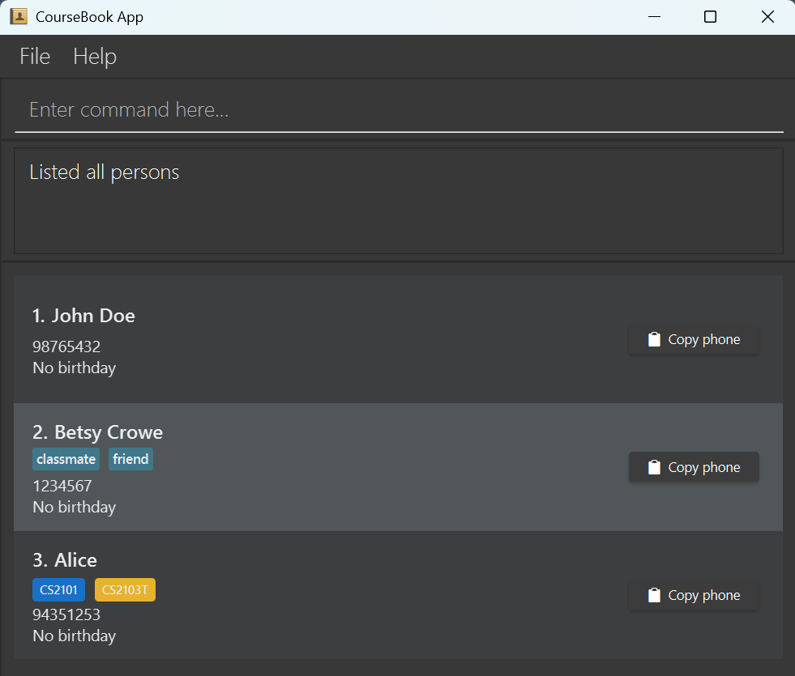
*Figure 4: State of CourseBook after adding the three people.*

<div markdown="span" class="alert alert-danger">

**:exclamation: Warning:**

* Duplicate detection checks name, phone, and email. If any match an existing contact, the add will fail.
* Names must contain only alphabetic characters (A-Z, a-z, spaces).

</div>

**Related:** [Editing a person](#412-editing-a-person-edit), [Adding courses to a person](#43-course-management-commands)

---

#### 4.1.2 Editing a person: `edit`

Edits an existing contact's details.

**Format:** `edit INDEX [n/NAME] [p/PHONE] [e/EMAIL] [a/ADDRESS] [t/TAG]... [c/COURSE]...`

**Parameters:**

* `INDEX` (Required) — Position in the currently displayed list (positive integer)
* At least one optional field must be provided
* All other parameters same as `add` command

**Behavior:**

* Existing values are replaced by new input values
* When editing tags: all existing tags are replaced (not cumulative)
* When editing courses: all existing courses are replaced (not cumulative)
* Birthday and favorite status are preserved if not edited
* To clear all tags: use `t/` with no value
* To clear all courses: use `c/` with no value

<div markdown="span" class="alert alert-primary">

**:bulb: Tip:**

* After editing, the view automatically switches to show all persons (not just the filtered list).
* Use `addcourse` or `removecourse` if you want to modify courses without replacing all existing ones.

</div>

**Examples:**

```
edit 1 p/91234567 e/johndoe@example.com
```
*Edits the 1st person's phone and email*

```
edit 2 n/Betsy Crower t/
```
*Edits the 2nd person's name and clears all tags*

```
edit 3 c/CS2103T c/CS2040S
```
*Replaces the 3rd person's courses with CS2103T and CS2040S*

```
edit 4 c/
```
*Removes all courses from the 4th person*

**Expected Output:**
```
Edited Person: Betsy Crower; Phone: 1234567; Email: betsycrowe@example.com; Address: Newgate Prison; Tags: ; Courses:
```

**Error Messages:**

* `"The person index provided is invalid"` — Index out of range
* `"At least one field to edit must be provided."` — No fields specified
* `"This person's name/phone/email already exists in the address book."` — Duplicate detected

**Related:** [Adding a person](#411-adding-a-person-add), [Adding courses](#431-adding-courses-to-a-person-addcourse)

---

#### 4.1.3 Deleting person(s): `delete` or `rm`

Deletes one or more contacts from the coursebook. Can delete by index or by name.

**Format (by index):** `delete INDEX [INDEX]...`

**Format (by name):** `delete NAME[, NAME]...`

**Alias:** `rm` can be used instead of `delete`

**Parameters:**

* **By index:** Space-separated positive integers (e.g., `1 2 3`)
* **By name:** Comma-separated names, case-insensitive (e.g., `John Doe, Jane Smith`)
* **Cannot mix:** You cannot use indices and names in the same command

**Confirmation Required:**
Before deletion, a confirmation dialog appears showing the contacts to be deleted. You must click "OK" to confirm or "Cancel" to abort.

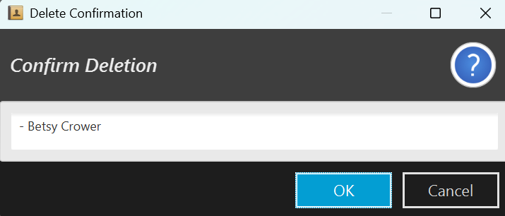
*Figure 5: Delete confirmation window pop up.*

<div markdown="span" class="alert alert-danger">

**:exclamation: Warning:**

* This action is irreversible after confirmation (except via `undo`).
* Make sure you review the confirmation dialog carefully before clicking "OK".

</div>

**Behavior:**

* **Invalid indices:** If some indices are invalid, valid ones are still shown in the confirmation dialog with warnings.
* **Name matching:** Full name must match (case-insensitive). Partial names won't work.
* **Multiple name matches:** If a name matches multiple contacts, that name is skipped with an error. Use indices instead.

<div markdown="span" class="alert alert-primary">

**:bulb: Tip:**

* After `find` or `list c/COURSE`, indices refer to the filtered results, not the full list.
* If unsure about names, use `find` first to see exact names, then delete by index.

</div>

**Examples:**

```
delete 1
```
*Shows confirmation dialog for the 1st person in the current list*

```
delete 1 2 3
```
*Shows confirmation dialog for the 1st, 2nd, and 3rd persons*

```
delete John Doe
```
*Shows confirmation dialog for person named "John Doe"*

```
delete John Doe, Jane Smith
```
*Shows confirmation dialog for "John Doe" and "Jane Smith"*

```
list
delete 2
```
*Deletes the 2nd person in the full address book (after confirming)*

```
find Betsy
delete 1
```
*Deletes the 1st person in the find results (after confirming)*

**Expected Output (before confirmation):**
```
Are you sure you want to delete the following person(s)?

1. John Doe

Please confirm to proceed with deletion.
```

**Expected Output (after confirmation):**
```
Deleted Person: John Doe
```

**Expected Output (multiple deletions):**
```
Deleted 3 person(s):
1. John Doe
2. Jane Smith
3. Alice Tan
```

**Expected Output (with warnings):**
```
Deleted 1 person(s):
1. John Doe

Warnings:
Index 99 is out of range.
```

**Error Messages:**

* `"No such contact found! Please specify correct contact names."` — Name doesn't match any contact
* `"Multiple contacts found with that name. Please delete by index from the list:"` — Name matches multiple contacts
* `"No valid persons to delete."` — All specified targets are invalid

**Related:** [Undoing commands](#47-undo--redo), [Finding persons](#415-finding-persons-find-or-f)

---

#### 4.1.4 Listing all persons: `list` or `ls`

Shows all contacts in your coursebook.

**Format:** `list`

**Alias:** `ls`

**Parameters:** None

**Expected Output:**
```
Listed all persons
```

**Related:** [Listing persons by course](#432-listing-persons-in-a-course-list-ccourse_code), [Finding persons](#415-finding-persons-find-or-f)

---

#### 4.1.5 Finding persons: `find` or `f`

Finds contacts by searching across multiple fields with partial/substring matching.

**Format:** `find [n/NAME_KEYWORDS] [p/PHONE_KEYWORDS] [e/EMAIL_KEYWORDS] [a/ADDRESS_KEYWORDS] [t/TAG]...`

**Alias:** `f`

**Parameters:**

* `n/NAME_KEYWORDS` (Optional) — Name search keywords (alphabetic only)
* `p/PHONE_KEYWORDS` (Optional) — Phone search keywords
* `e/EMAIL_KEYWORDS` (Optional) — Email search keywords
* `a/ADDRESS_KEYWORDS` (Optional) — Address search keywords
* `t/TAG` (Optional) — Tag search
* **No prefixes:** If no prefixes are used, input is treated as name search

**Search Logic:**

* **Within a field:** OR logic — any keyword matches
* **Across fields:** OR logic — match any field
* **Case-insensitive** and **partial/substring matching**
* For names (with or without `n/`): keywords must be alphabetic (A-Z, a-z)

<div markdown="span" class="alert alert-primary">

**:bulb: Tip:**

* Use partial matches to find contacts quickly: `find n/ali` finds "Alice", "Alicia", etc.
* Combine multiple fields to broaden your search: `find n/John e/@gmail` finds anyone named John OR with a Gmail address.
* Unknown prefixes are rejected to prevent typos.

</div>

**Examples:**

```
find n/Alice n/Bob
```
*Finds persons with names containing "Alice" OR "Bob"*

```
find n/Ali
```
*Finds "Alice", "Alicia", "Alison" (partial match)*

```
find p/9123 e/example.com
```
*Finds phone containing "9123" OR email containing "example.com"*

```
find t/fri
```
*Finds persons with tags containing "fri" (e.g., "friend")*

```
find n/Alice t/friend
```
*Finds persons with name containing "Alice" OR tag containing "friend"*

```
find alex david
```
*No prefixes → name-only search for "alex" or "david"*

**Expected Output (found):**
```
3 persons listed!
```

**Expected Output (not found):**
```
No such contact found
```

**Error Messages:**

* Unknown prefix error if you use prefixes other than `n/`, `p/`, `e/`, `a/`, `t/`
* Invalid name keywords if names contain non-alphabetic characters

**Related:** [Listing all persons](#414-listing-all-persons-list-or-ls), [Listing by course](#432-listing-persons-in-a-course-list-ccourse_code)

---

#### 4.1.6 Viewing detailed information: `viewperson`

Shows detailed information about a specific contact in a popup window.

**Format (by index):** `viewperson INDEX`

**Format (by name):** `viewperson NAME`

**Parameters:**

* `INDEX` — Position in currently displayed list (positive integer)
* `NAME` — Full name of the person (case-insensitive, must match exactly)

**Behavior:**

* If multiple persons have the same name, an error is shown. Use index instead.
* Name matching is case-insensitive and automatically trims whitespace.

**Examples:**

```
viewperson 1
```
*Shows details of the 1st person in the current list*

```
viewperson John Doe
```
*Shows details of the person named "John Doe"*

**Expected Output:**
```
Showing details for: John Doe
```
*A popup window displays full contact details including courses, tags, birthday, etc.*

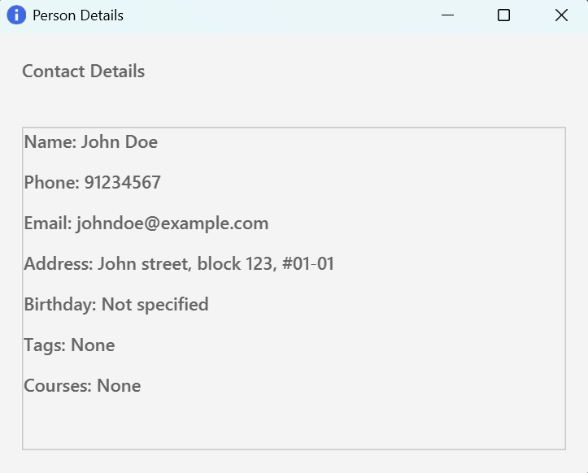
*Figure 6: Popup window of the details of the person named "John Doe".*

**Error Messages:**

* `"The person index provided is invalid"` — Index out of range
* `"No contacts found! Please specify correct contact names."` — Name doesn't match
* `"Multiple contacts found with that name. Please view by index from the list:"` — Ambiguous name

**Related:** [Finding persons](#415-finding-persons-find-or-f), [Listing persons](#414-listing-all-persons-list-or-ls)

---

#### 4.1.7 Adding a birthday: `bday`

Adds a birthday to an existing contact.

**Format:** `bday INDEX b/BIRTHDAY`

**Parameters:**

* `INDEX` (Required) — Position in currently displayed list (positive integer)
* `b/BIRTHDAY` (Required) — Birthday in `DD-MM-YYYY` format

**Constraints:**

* Date must be valid (e.g., 29-02-2000 is valid, 31-02-2000 is not)
* Birthday cannot be in the future
* Birthday cannot be before 01-01-1900
* Only one birthday per person

**Behavior:**

* If person already has a birthday, it is updated to the new one
* If the new birthday is the same as the existing one, the command fails

<div markdown="span" class="alert alert-primary">

**:bulb: Tip:**

* After adding birthdays, use `sortb` to sort contacts by upcoming birthdays.
* Birthdays are displayed on person cards and in the detail view.

</div>

**Examples:**

```
bday 1 b/20-02-2007
```
*Adds birthday 20th February 2007 to the 1st person*

```
bday 2 b/15-12-1995
```
*Adds birthday 15th December 1995 to the 2nd person*

**Expected Output:**
```
Added birthday: 20-02-2007 John Doe; Phone: 98765432; Email: johnd@example.com; Address: John street, block 123, #01-01; Tags: ; Courses:
```

**Error Messages:**

* `"The person index provided is invalid"` — Index out of range
* `"Birthday has already been added!"` — Trying to add the same birthday again

**Related:** [Sorting by birthday](#442-sorting-by-birthday-sortb), [Editing a person](#412-editing-a-person-edit)

---

#### 4.1.8 Managing favorites: `favourite` and `unfavourite`

Mark contacts as favorites or remove them from favorites.

**Format (mark as favorite, by index):** `favourite INDEX`

**Format (mark as favorite, by name):** `favourite NAME`

**Format (remove from favorites, by index):** `unfavourite INDEX`

**Format (remove from favorites, by name):** `unfavourite NAME`

**Parameters:**

* `INDEX` — Position in currently displayed list (positive integer)
* `NAME` — Full name (case-insensitive, must match exactly)

**Behavior:**

* Favorite persons are marked with a star (★) in the person list
* Cannot favorite a person who is already favorited
* Cannot unfavorite a person who is not favorited
* Name matching is case-insensitive with automatic whitespace trimming
* If multiple persons have the same name, an error is shown. Use index instead.

<div markdown="span" class="alert alert-primary">

**:bulb: Tip:**

* Use `favs` command to quickly view all your favorite contacts.
* Combine favorites with course filtering to find your closest study partners in specific modules.

</div>

**Examples:**

```
favourite 1
```
*Marks the 1st person as favorite*

```
favourite John Doe
```
*Marks "John Doe" as favorite*

```
unfavourite 2
```
*Removes the 2nd person from favorites*

```
unfavourite Jane Smith
```
*Removes "Jane Smith" from favorites*

**Expected Output (favorite):**
```
Marked as favourite: John Doe; Phone: 98765432; Email: johnd@example.com; Address: John street, block 123, #01-01; Tags: ; Courses:
```

**Expected Output (unfavorite):**
```
Removed from favourites: Jane Smith; Phone: 91234567; Email: janesmith@example.com; Address: Main St; Tags: ; Courses:
```

**Error Messages:**

* `"This person is already marked as favourite."` — Trying to favorite an already favorited person
* `"This person is not marked as favourite."` — Trying to unfavorite a person who isn't favorited
* `"Multiple contacts found with that name. Please favourite by index from the list:"` — Ambiguous name

**Related:** [Listing favorites](#419-listing-favorite-persons-favs)

---

#### 4.1.9 Listing favorite persons: `favs`

Shows all contacts marked as favorites.

**Format:** `favs`

**Parameters:** None

**Expected Output (with favorites):**
```
Listed all favourite contacts.
```
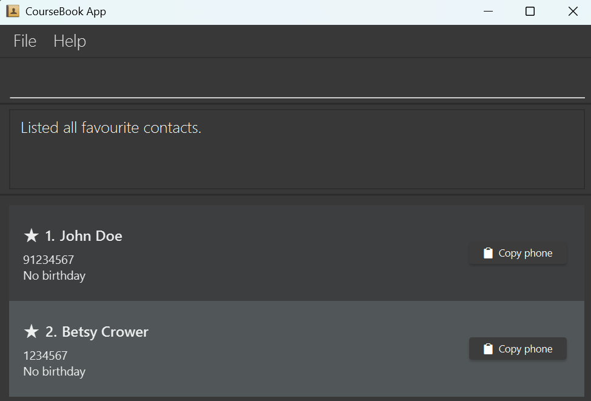
*Figure 7: List of favourite contacts.*


**Expected Output (no favorites):**
```
No favourite contacts yet.
```

**Related:** [Managing favorites](#418-managing-favorites-favourite-and-unfavourite)

---

### 4.2 Course Management Commands

#### 4.2.1 Adding courses to a person: `addcourse`

Adds one or more courses to a contact without replacing existing courses.

**Format:** `addcourse INDEX c/COURSE_CODE[,COLOR] [c/COURSE_CODE[,COLOR]]...`

**Parameters:**

* `INDEX` (Required) — Position in currently displayed list (positive integer)
* `c/COURSE_CODE[,COLOR]` (Required, multiple allowed) — Course code with optional color

**Available Colors:** `green`, `yellow`, `red`, `blue`, `orange`, `purple`, `pink`

**Behavior:**

* Preserves existing courses (unlike `edit` which replaces)
* If course already exists for the person, command fails
* If a course code already exists globally and you supply a different color, the global color is updated
* If a new course code is added without color, it defaults to `green`

<div markdown="span" class="alert alert-primary">

**:bulb: Tip:**

* Use `addcourse` when you want to add courses without affecting existing ones.
* Use `edit` when you want to completely replace all courses.
* Course colors are global — changing a color for CS2103T changes it for all contacts with CS2103T.

</div>

**Examples:**

```
addcourse 1 c/CS2103T,yellow
```
*Adds CS2103T with yellow color to the 1st person*

```
addcourse 2 c/CS2101 c/CS2040S,blue
```
*Adds CS2101 (default green) and CS2040S (blue) to the 2nd person*

**Expected Output:**
```
Added courses to Person: John Doe; Phone: 98765432; Email: johnd@example.com; Address: John street, block 123, #01-01; Tags: ; Courses: [CS2103T], [CS2101]
```

**Error Messages:**

* `"The person index provided is invalid"` — Index out of range
* `"This person already has one or more of these courses"` — Duplicate course

**Related:** [Removing courses](#422-removing-courses-from-a-person-removecourse), [Editing course color](#423-editing-course-color-globally-editcourse)

---

#### 4.2.2 Removing courses from a person: `removecourse`

Removes one or more courses from a contact.

**Format:** `removecourse INDEX c/COURSE_CODE [c/COURSE_CODE]...`

**Parameters:**

* `INDEX` (Required) — Position in currently displayed list (positive integer)
* `c/COURSE_CODE` (Required, multiple allowed) — Course codes to remove (case-insensitive)

**Behavior:**

* Only removes courses that exist for the person
* If none of the specified courses exist for the person, command fails

**Examples:**

```
removecourse 1 c/CS2103T
```
*Removes CS2103T from the 1st person*

```
removecourse 2 c/CS2101 c/CS2040S
```
*Removes CS2101 and CS2040S from the 2nd person*

**Expected Output:**
```
Removed courses from Person: John Doe; Phone: 98765432; Email: johnd@example.com; Address: John street, block 123, #01-01; Tags: ; Courses:
```

**Error Messages:**

* `"The person index provided is invalid"` — Index out of range
* `"None of the specified courses exist for this person"` — Courses not found

**Related:** [Adding courses](#421-adding-courses-to-a-person-addcourse), [Editing a person](#412-editing-a-person-edit)

---

#### 4.2.3 Editing course color globally: `editcourse`

Sets the color for a course code globally across all contacts.

**Format:** `editcourse c/COURSE_CODE,COLOR`

**Parameters:**

* `c/COURSE_CODE,COLOR` (Required) — Course code and color (comma-separated)

**Available Colors:** `green`, `yellow`, `red`, `blue`, `orange`, `purple`, `pink`

**Behavior:**

* Updates the color for the course code globally
* All contacts with this course code will reflect the new color
* Both course code and color must be provided

<div markdown="span" class="alert alert-primary">

**:bulb: Tip:**

* Use consistent colors for similar course types (e.g., yellow for all CS courses, blue for math courses).
* This helps with visual organization when viewing contact lists.

</div>

**Examples:**

```
editcourse c/CS2103T,red
```
*Changes CS2103T color to red for all contacts*

```
editcourse c/CS2101,green
```
*Changes CS2101 color to green for all contacts*

**Expected Output:**
```
Updated color for CS2103T to red
```

**Error Messages:**

* `"Course code and color must be provided"` — Missing course code or color

**Related:** [Adding courses](#421-adding-courses-to-a-person-addcourse), [Listing courses](#424-listing-all-courses-listcourses)

---

#### 4.2.4 Listing all courses: `listcourses`

Lists all unique courses in the coursebook.

**Format:** `listcourses`

**Parameters:** None

**Behavior:**

* Shows all courses with their enrollment counts
* Switches to the courses view panel

**Expected Output (with courses):**
```
Listed 5 course(s)
```

**Expected Output (no courses):**
```
No courses found in the course book
```

**Related:** [Listing persons by course](#425-listing-persons-in-a-course-list-ccourse_code), [Summary](#46-viewing-summary-statistics-summary)

---

#### 4.2.5 Listing persons in a course: `list c/COURSE_CODE`

Shows all contacts enrolled in a specific course.

**Format:** `list c/COURSE_CODE`

**Alias:** `ls c/COURSE_CODE`

**Parameters:**

* `c/COURSE_CODE` (Required) — Course code to filter by (case-insensitive)

**Behavior:**

* Course code matching is case-insensitive
* If course exists but has no enrollments, an empty list is shown
* If course doesn't exist, an empty list is shown with an error message

**Examples:**

```
list c/CS2103T
```
*Shows all persons taking CS2103T*

```
ls c/cs2101
```
*Shows all persons taking CS2101 (case-insensitive)*

**Expected Output (found):**
```
Listed all persons in CS2103T
```
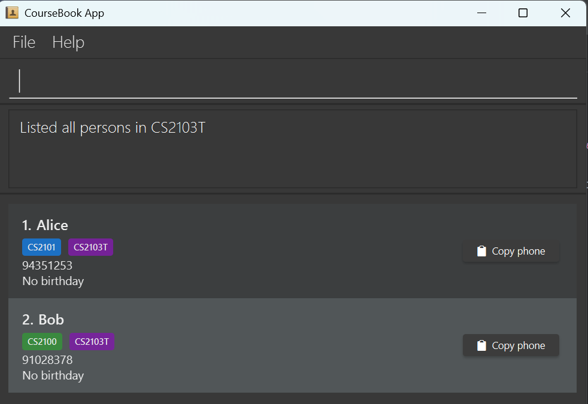
*Figure 8: List of contacts taking course CS2103T.*

**Expected Output (not found):**
```
No such course: CS9999
```

**Related:** [Listing all persons](#414-listing-all-persons-list-or-ls), [Listing courses](#424-listing-all-courses-listcourses)

---

### 4.3 Display and Navigation Commands

#### 4.3.1 Navigating to home: `home`

Returns to the home page showing all courses.

**Format:** `home`

**Parameters:** None

**Behavior:**

* Switches view to the courses panel
* Shows all courses with enrollment counts

**Expected Output:**
```
Welcome home!
```
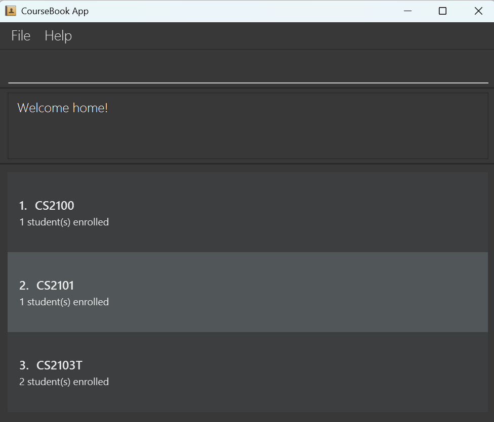
*Figure 9: Home view.*

**Related:** [Listing courses](#424-listing-all-courses-listcourses)

---

#### 4.3.2 Changing application theme: `theme`

Changes the application's visual theme.

**Format:** `theme THEME_NAME`

**Available Themes:**

* `dark` — Dark theme (default)
* `blue` — Blue theme
* `love` — Love theme (pink/romantic colors)
* `tree` — Tree theme (nature-inspired)

**Parameters:**

* `THEME_NAME` (Required) — One of: `dark`, `blue`, `love`, `tree` (case-insensitive)

**Behavior:**

* Theme change is applied immediately
* Preference is saved for future sessions
* Cannot switch to the currently active theme

<div markdown="span" class="alert alert-primary">

**:bulb: Tip:**

* Choose a theme that matches your preferences or reduces eye strain.
* Theme persists across sessions — you only need to set it once.

</div>

**Examples:**

```
theme blue
```
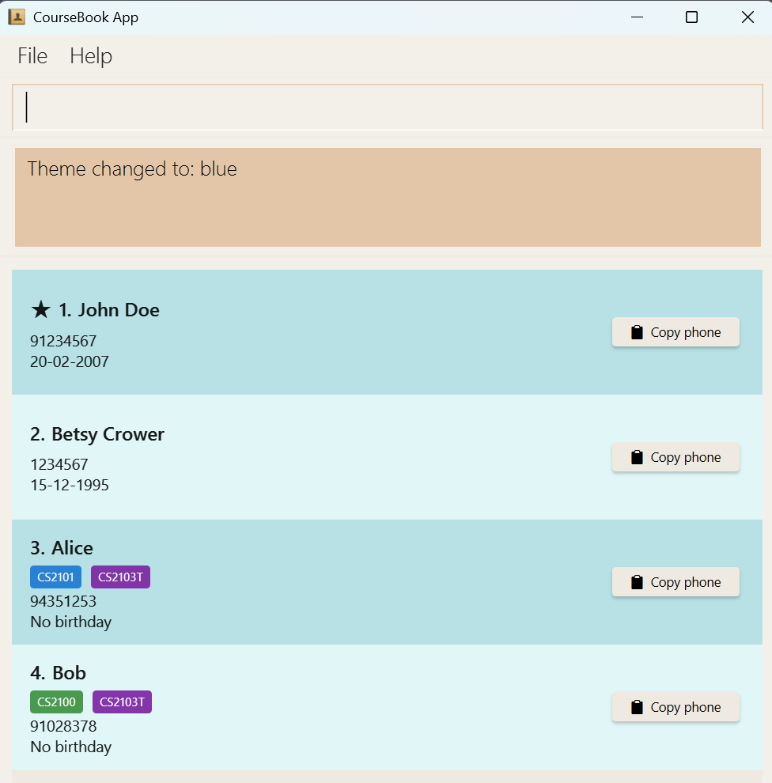
*Figure 9: Changes to blue theme.*
```
theme dark
```
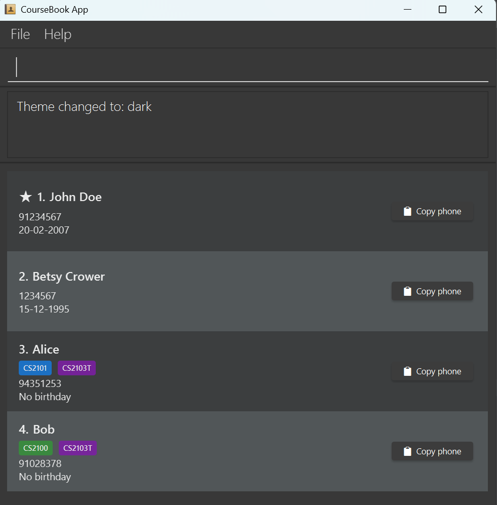
*Figure 10: Changes to dark theme.*

```
theme love
```
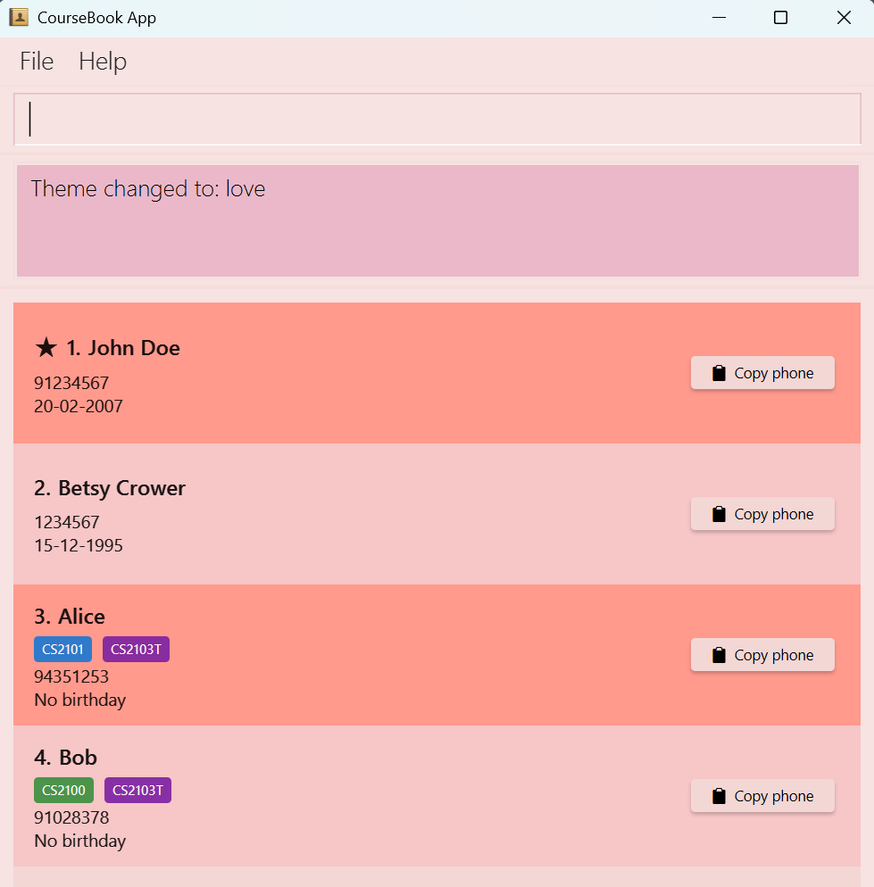
*Figure 11: Changes to love theme.*

```
theme tree
```
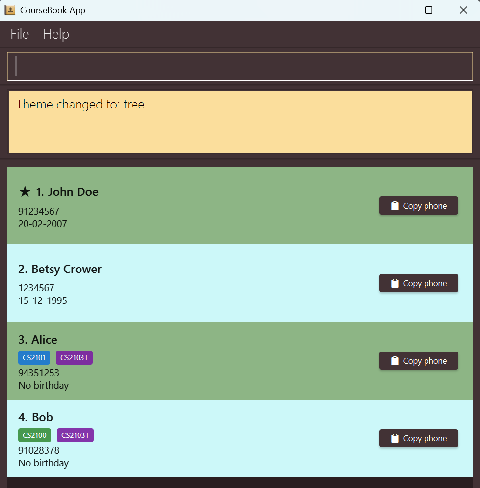
*Figure 12: Changes to tree theme.*


**Expected Output:**
```
Theme changed to: tree
```

**Error Messages:**

* `"Invalid theme name. Available themes: dark, blue, love, tree"` — Unrecognized theme
* `"Theme is already dark!"` — Trying to switch to current theme

**Related:** [Undoing commands](#47-undo--redo)

---

### 4.4 Sorting Commands

#### 4.4.1 Sorting by name: `sortn`

Sorts the contact list by name in ascending or descending order.

**Format:** `sortn by/ORDER`

**Parameters:**

* `by/ORDER` (Required) — Sort order: `asc` (ascending A-Z) or `desc` (descending Z-A)

**Behavior:**

* Case-insensitive order matching
* Sorts by person's full name
* Sort order persists until another list/filter command is used

**Examples:**

```
sortn by/asc
```
*Sorts names A to Z*

```
sortn by/desc
```
*Sorts names Z to A*

**Expected Output (with results):**
```
Sorted contacts by name in ascending order.
```

**Expected Output (empty list):**
```
No contacts to sort by name.
```

**Error Messages:**

* Incorrect format if order is missing or invalid

**Related:** [Sorting by birthday](#442-sorting-by-birthday-sortb), [Listing persons](#414-listing-all-persons-list-or-ls)

---

#### 4.4.2 Sorting by birthday: `sortb`

Sorts contacts by how soon their next birthday occurs.

**Format:** `sortb`

**Parameters:** None

**Behavior:**

* Contacts with upcoming birthdays appear first
* Automatically handles year calculation (uses current year or next year if birthday has passed)
* Contacts without birthdays are placed at the end

<div markdown="span" class="alert alert-primary">

**:bulb: Tip:**

* Use this command to see whose birthdays are coming up soon.
* Combine with `favs` to see favorite contacts' birthdays first: `favs` followed by `sortb`.

</div>

**Example:**

```
sortb
```
*Sorts contacts by upcoming birthdays*

**Expected Output (with results):**
```
Sorted contacts by upcoming birthday.
```
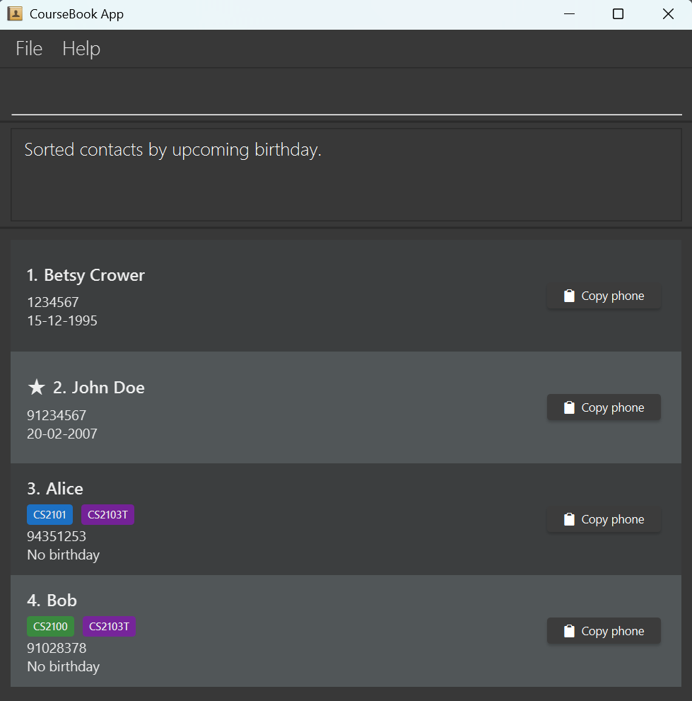
*Figure 13: Sorted contacts.*

**Expected Output (empty list):**
```
No contacts to sort by birthday.
```

**Related:** [Adding birthdays](#417-adding-a-birthday-bday), [Sorting by name](#441-sorting-by-name-sortn)

---

### 4.5 History and Information Commands

#### 4.5.1 Viewing command history: `history`

Shows all commands executed in the current session.

**Format:** `history`

**Parameters:** None

**Behavior:**

* Commands are listed from most recent to oldest (reverse chronological order)
* Each command is numbered starting from 1
* History is cleared when the application is closed

**Example:**

```
history
```

**Expected Output:**
```
History (from latest to earliest)
1. add n/John Doe p/12345678 e/john@example.com a/123 Main St
2. list
3. find alex
4. delete 1
```

**Expected Output (no history):**
```
No commands in history!
```

**Related:** [Undoing commands](#47-undo--redo)

---

#### 4.5.2 Viewing summary statistics: `summary`

Shows a summary of all contacts with breakdown by course enrollment.

**Format:** `summary`

**Parameters:** None

**Behavior:**

* Displays total number of persons
* Shows enrollment counts for each course
* Courses are sorted alphabetically
* Handles persons with multiple courses correctly

**Example:**

```
summary
```

**Expected Output:**
```
Summary: 15 person(s) found

Breakdown by course:
CS2030S: 5 person(s)
CS2040S: 8 person(s)
CS2101: 6 person(s)
CS2103T: 10 person(s)
```

**Expected Output (empty coursebook):**
```
Course book is empty. Please add persons before viewing summary.
```

**Related:** [Listing courses](#424-listing-all-courses-listcourses), [Listing by course](#425-listing-persons-in-a-course-list-ccourse_code)

---

### 4.6 General Application Commands

#### 4.6.1 Viewing help: `help`

Opens the help window displaying all available commands.

**Format:** `help`

**Parameters:** None

**Behavior:**

* Opens a help window with a table of all commands
* Shows command names, descriptions, and examples
* Includes a link to the full User Guide
* Has a "Copy URL" button to copy the User Guide link to clipboard

**Example:**

```
help
```

**Expected Output:**
```
Opened help window.
```

!Help message[Help Window](images/helpMessage.png)
*Figure 3: Help window showing command summary table*

<div markdown="span" class="alert alert-primary">

**:bulb: Tip:**

* Use keyboard shortcut `F1` to quickly open the help window.
* Click "Copy URL" in the help window to get the link to the full online User Guide.

</div>

**Related:** [Command summary table](#5-command-summary)

---

#### 4.6.2 Clearing all entries: `clear`

Removes all contacts from the coursebook.

**Format:** `clear`

**Parameters:** None

<div markdown="span" class="alert alert-danger">

**:exclamation: Warning:**

* This action removes ALL contacts permanently (except via `undo`).
* Consider exporting your data file before using this command.

</div>

**Example:**

```
clear
```

**Expected Output:**
```
Address book has been cleared!
```

**Related:** [Undoing commands](#47-undo--redo), [Data storage](#6-data--storage)

---

#### 4.6.3 Exiting the program: `exit`

Exits the CourseBook application.

**Format:** `exit`

**Parameters:** None

**Behavior:**

* Saves all data automatically before exiting
* Closes all windows (main window, help window, etc.)

**Example:**

```
exit
```

**Expected Output:**
```
Exiting Address Book as requested ...
```

**Related:** [Data storage](#6-data--storage)

---

### 4.7 Undo & Redo

#### 4.7.1 Undoing commands: `undo`

Reverts the last command that changed the coursebook.

**Format:** `undo`

**Parameters:** None

**Behavior:**

* Only undoes commands that modify data (e.g., `add`, `delete`, `edit`)
* Cannot undo read-only commands (e.g., `list`, `find`)
* Can undo multiple times in sequence
* After undo, the view switches to show all persons

<div markdown="span" class="alert alert-primary">

**:bulb: Tip:**

* You can undo multiple commands by running `undo` repeatedly.
* Use `redo` to reapply undone commands if you change your mind.

</div>

**Example:**

```
undo
```

**Expected Output:**
```
Undo success!
```

**Error Messages:**

* `"No more commands to undo!"` — No undoable commands in history

**Related:** [Redoing commands](#472-redoing-commands-redo), [Command history](#451-viewing-command-history-history)

---

#### 4.7.2 Redoing commands: `redo`

Reapplies the last undone command.

**Format:** `redo`

**Parameters:** None

**Behavior:**

* Reapplies the last command that was undone
* Can redo multiple times in sequence
* After redo, the view switches to show all persons

**Example:**

```
redo
```

**Expected Output:**
```
Redo success!
```

**Error Messages:**

* `"No more commands to redo!"` — No redoable commands

**Related:** [Undoing commands](#471-undoing-commands-undo)

---

### 4.8 UI Features

#### 4.8.1 Copy phone number to clipboard

Each person card has a copy button on the right side that copies the phone number to your clipboard.

**How to use:**

1. Locate the person card in the person list panel
2. Click the copy icon button on the right side of the card
3. The phone number is now in your clipboard and can be pasted anywhere

<div markdown="span" class="alert alert-primary">

**:bulb: Tip:**

* This is faster than manually selecting and copying phone numbers.
* Use this feature when you need to call or message a contact.

</div>

---

## 5. Command Summary

| Command | Purpose | Format | Example |
|---------|---------|--------|---------|
| **add** | Adds a person | `add n/NAME p/PHONE e/EMAIL a/ADDRESS [t/TAG]... [c/COURSE[,COLOR]]...` | `add n/John Doe p/98765432 e/johnd@example.com a/123 Main St c/CS2103T,yellow` |
| **edit** | Edits a person's details | `edit INDEX [n/NAME] [p/PHONE] [e/EMAIL] [a/ADDRESS] [t/TAG]... [c/COURSE]...` | `edit 1 p/91234567 e/johndoe@example.com` |
| **delete / rm** | Deletes person(s) (requires confirmation) | `delete INDEX [INDEX]...` OR `delete NAME[, NAME]...` | `delete 1 2 3` OR `delete John Doe, Jane Smith` |
| **list / ls** | Lists all persons | `list` | `list` |
| **list / ls** | Lists persons in a course | `list c/COURSE_CODE` | `list c/CS2103T` |
| **find / f** | Finds persons by fields | `find [n/NAME] [p/PHONE] [e/EMAIL] [a/ADDRESS] [t/TAG]...` | `find n/Alice t/friend` |
| **viewperson** | Views detailed person info | `viewperson INDEX` OR `viewperson NAME` | `viewperson 1` OR `viewperson John Doe` |
| **bday** | Adds birthday to a person | `bday INDEX b/BIRTHDAY` | `bday 1 b/20-02-2007` |
| **favourite** | Marks person as favorite | `favourite INDEX` OR `favourite NAME` | `favourite 1` OR `favourite John Doe` |
| **unfavourite** | Removes favorite status | `unfavourite INDEX` OR `unfavourite NAME` | `unfavourite 1` |
| **favs** | Lists all favorite persons | `favs` | `favs` |
| **addcourse** | Adds courses to a person | `addcourse INDEX c/COURSE[,COLOR] [c/COURSE[,COLOR]]...` | `addcourse 1 c/CS2103T,yellow c/CS2101` |
| **removecourse** | Removes courses from a person | `removecourse INDEX c/COURSE [c/COURSE]...` | `removecourse 1 c/CS2103T c/CS2101` |
| **editcourse** | Sets course color globally | `editcourse c/COURSE,COLOR` | `editcourse c/CS2103T,red` |
| **listcourses** | Lists all courses | `listcourses` | `listcourses` |
| **sortn** | Sorts contacts by name | `sortn by/ORDER` (asc or desc) | `sortn by/asc` |
| **sortb** | Sorts contacts by birthday | `sortb` | `sortb` |
| **theme** | Changes application theme | `theme THEME_NAME` (dark, blue, love, tree) | `theme blue` |
| **home** | Returns to home (courses view) | `home` | `home` |
| **summary** | Shows summary statistics | `summary` | `summary` |
| **undo** | Reverts last change | `undo` | `undo` |
| **redo** | Reapplies last undone change | `redo` | `redo` |
| **history** | Shows command history | `history` | `history` |
| **clear** | Removes all contacts | `clear` | `clear` |
| **help** | Opens help window | `help` | `help` |
| **exit** | Exits the application | `exit` | `exit` |

---

## 6. Data & Storage

### 6.1 Automatic Saving

CourseBook automatically saves your data after any command that changes the data. There is no need to save manually.

**Data File Location:** `[JAR file location]/data/CourseBook.json`

**Preferences File Location:** `[JAR file location]/preferences.json`

### 6.2 Editing the Data File

Advanced users can update data directly by editing the `CourseBook.json` file.

<div markdown="span" class="alert alert-danger">

**:exclamation: Caution:**

* If your changes make the format invalid, CourseBook will discard all data and start with an empty data file at the next run.
* **Always backup the file before editing.**
* Certain edits can cause unexpected behavior (e.g., values outside acceptable ranges).
* Only edit if you are confident you can update it correctly.

</div>

### 6.3 Transferring Data to Another Computer

To transfer your CourseBook data:

1. Install CourseBook on the new computer
2. Run it once to create the data folder structure
3. Replace the empty `CourseBook.json` file with your existing data file
4. (Optional) Copy `preferences.json` to preserve theme and window settings

---

## 7. FAQ

**Q: How do I transfer my data to another computer?**
**A:** Install CourseBook on the new computer and replace the empty data file it creates with your existing `CourseBook.json` file. See [Section 6.3](#63-transferring-data-to-another-computer).

**Q: Why does `delete` show a confirmation dialog?**
**A:** This is a safety feature to prevent accidental deletions. Always review the confirmation dialog before clicking "OK".

**Q: Can I undo a `clear` command?**
**A:** Yes, use the `undo` command immediately after `clear` to restore all contacts.

**Q: How do I change a person's birthday?**
**A:** Use the `bday` command with a new date. If the person already has a birthday, it will be updated (unless it's the same date, which will fail).

**Q: Can I search by partial names?**
**A:** Yes, the `find` command uses partial/substring matching. `find n/ali` will match "Alice", "Alicia", etc.

**Q: Do course colors apply to all persons with that course?**
**A:** Yes, course colors are global. Changing the color for CS2103T will update it for everyone enrolled in CS2103T.

**Q: What happens if I enter an invalid command?**
**A:** CourseBook will display an error message explaining what went wrong and suggest the correct format.

---

## 8. Glossary

| Term | Definition |
|------|------------|
| **CLI** | Command Line Interface — text-based interface where users type commands |
| **GUI** | Graphical User Interface — visual interface with buttons, windows, and icons |
| **Index** | Position number of a person in the currently displayed list (1-based) |
| **Parameter** | Information you provide to a command (e.g., name, phone, email) |
| **Prefix** | Letters followed by `/` that identify a parameter (e.g., `n/` for name) |
| **Tag** | Label you assign to contacts for categorization (e.g., "friend", "classmate") |
| **Course Code** | Unique identifier for a course (e.g., CS2103T, CS2101) |
| **Favorite** | Contacts marked with a star (★) for quick access |
| **Partial Match** | Search that finds results containing the keyword (e.g., "ali" finds "Alice") |
| **Case-Insensitive** | Search/matching that ignores uppercase/lowercase differences |
| **JSON** | JavaScript Object Notation — file format used to store CourseBook data |
| **JAR** | Java Archive — executable file format for Java applications |

---

## Appendix A: Screenshot Asset Plan

The following screenshots should be captured and placed in `docs/images/` to complete this User Guide:

| Filename                 | Description                                                                             |
|--------------------------|-----------------------------------------------------------------------------------------|
| `UiClassDiagram.png`     | Main UI with labeled components (Command Box, Result Display, Person List, Course View) |
| `AddCommand.png`         | Screenshot after executing `add` command showing new contact added                      |
| `DeleteConfirmation.png` | Confirmation dialog displayed during delete operation                                   |
| `ViewpersonPopup.png`    | Person detail popup window from `viewperson` command                                    |
| `HelpWindow.png`         | Help window showing command summary table                                               |
| `FindResults.png`        | Person list filtered after `find` command                                               |
| `ListByCourse.png`       | Person list filtered to one course using `list c/`                                      |
| `FavsList.png`           | Person list showing only favorites (with star icons)                                    |
| `ThemeBlue.png`          | Application with blue theme applied                                                     |
| `ThemeLove.png`          | Application with love theme applied                                                     |
| `ThemeTree.png`          | Application with tree theme applied                                                     |
| `ThemeDark.png`          | Application with dark theme applied                                                     |
| `CoursesView.png`        | Courses panel showing all courses with enrollment counts                                |
| `CopyPhone.png`          | Close-up of person card highlighting the copy phone button                              |
| `SortBirthday.png`       | List sorted by upcoming birthdays                                                       |

---

**End of User Guide**

For support or to report issues, visit our [GitHub repository](https://github.com/AY2526S1-CS2103T-F10-2/tp).
