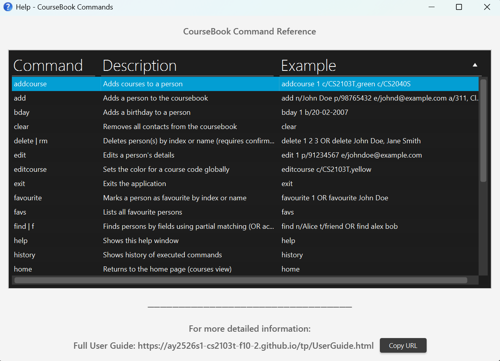

CourseBook ([CS2103T-F10-2]) is a **desktop app for managing university courses and schedules, optimized for use via a Command Line Interface** (CLI) while still having the benefits of a Graphical User Interface (GUI). If you can type fast, CourseBook can get your course management tasks done faster than traditional GUI apps.

- Table of Contents
  {:toc}

---

## Quick start

1. Ensure you have Java `17` or above installed in your Computer. 
   **Mac users:** Ensure you have the precise JDK version prescribed [here](https://se-education.org/guides/tutorials/javaInstallationMac.html).

1. Download the latest `.jar` file from [here](https://github.com/se-edu/CourseBook-level3/releases).

1. Copy the file to the folder you want to use as the _home folder_ for your CourseBook.

1. Open a command terminal, `cd` into the folder you put the jar file in, and use the `java -jar CourseBook.jar` command to run the application. 
   A GUI similar to the below should appear in a few seconds. Note how the app contains some sample data. 
   

1. Type the command in the command box and press Enter to execute it. e.g. typing **`help`** and pressing Enter will open the help window. 
   Some example commands you can try:

   - `list` : Lists all contacts.

   - `add n/John Doe p/98765432 e/johnd@example.com a/John street, block 123, #01-01` : Adds a contact named `John Doe` to the Address Book.

   - `delete 3` : Deletes the 3rd contact shown in the current list.

   - `clear` : Deletes all contacts.

   - `exit` : Exits the app.

1. Refer to the [Features](#features) below for details of each command.

---

## Features

**:information_source: Notes about the command format:** 

- Words in `UPPER_CASE` are the parameters to be supplied by the user. 
  e.g. in `add n/NAME`, `NAME` is a parameter which can be used as `add n/John Doe`.

- Items in square brackets are optional. 
  e.g `n/NAME [t/TAG]` can be used as `n/John Doe t/friend` or as `n/John Doe`.

- Items with `…`​ after them can be used multiple times including zero times. 
  e.g. `[t/TAG]…​` can be used as ` ` (i.e. 0 times), `t/friend`, `t/friend t/family` etc.

- Parameters can be in any order. 
  e.g. if the command specifies `n/NAME p/PHONE_NUMBER`, `p/PHONE_NUMBER n/NAME` is also acceptable.

- Extraneous parameters for commands that do not take in parameters (such as `help`, `list`, `exit` and `clear`) will be ignored. 
  e.g. if the command specifies `help 123`, it will be interpreted as `help`.

- If you are using a PDF version of this document, be careful when copying and pasting commands that span multiple lines as space characters surrounding line-breaks may be omitted when copied over to the application.

### Viewing help : `help`

Shows a message explaining how to access the help page.

Format: `help`

### Adding a person: `add`

Adds a person to the address book.

Format: `add n/NAME p/PHONE_NUMBER e/EMAIL a/ADDRESS [t/TAG]… [c/COURSE_CODE[,COLOR]]…​`

:bulb: **Tip:**
A person can have any number of tags (including 0)

Examples:

- `add n/John Doe p/98765432 e/johnd@example.com a/John street, block 123, #01-01`
- `add n/Betsy Crowe t/friend e/betsycrowe@example.com a/Newgate Prison p/1234567 t/criminal`
- `add n/Alice p/94351253 e/alice@example.com a/123, Jurong West Ave 6, #08-111 c/CS2103T,yellow c/CS2101`

### Listing all persons : `list|ls`

Shows a list of all persons in the address book.

Format: `list|ls`

### Listing all persons in a course: `list|ls c/COURSE_CODE`

Shows a list of all persons in the particular course.

- The course code is case-insensitive.
- If the course has no persons enrolled, an empty list is shown.
- If the course does not exist, an empty list is shown along with an error message.

Format: `list|ls c/COURSE_CODE`

### Editing a person : `edit`

Edits an existing person in the address book.

Format: `edit INDEX [n/NAME] [p/PHONE] [e/EMAIL] [a/ADDRESS] [t/TAG]…​ [c/COURSE]…`

- Edits the person at the specified `INDEX`. The index refers to the index number shown in the displayed person list. The index **must be a positive integer** 1, 2, 3, …​
- At least one of the optional fields must be provided.
- Existing values will be updated to the input values.
- When editing tags, the existing tags of the person will be removed i.e adding of tags is not cumulative.
- When editing courses, the existing courses of the person will be replaced by the provided courses (i.e., not cumulative).
- You can remove all the person’s tags by typing `t/` without
  specifying any tags after it.
- You can clear all courses by typing `c/` without specifying any course after it.

Examples:

- `edit 1 p/91234567 e/johndoe@example.com` Edits the phone number and email address of the 1st person to be `91234567` and `johndoe@example.com` respectively.
- `edit 2 n/Betsy Crower t/` Edits the name of the 2nd person to be `Betsy Crower` and clears all existing tags.
- `edit 3 c/CS2103T c/CS2040S` Replaces the 3rd person’s courses with `CS2103T` and `CS2040S`.
- `edit 4 c/` Clears all courses for the 4th person.

### Adding courses to a person: `addcourse`

Adds one or more courses to the specified person without replacing existing courses.

Format: `addcourse INDEX c/COURSE_CODE[,COLOR] [c/COURSE_CODE[,COLOR]]...`

- INDEX refers to the index in the currently displayed list (must be a positive integer).
- At least one `c/COURSE_CODE` must be provided.
- Duplicate courses (already assigned) will be rejected.
- Color behavior:
  - If a course code already exists anywhere and you supply a different COLOR, the color for that course code is updated globally to the new COLOR.
  - If a new course code is added without COLOR, it defaults to GREEN.

Examples:

- `addcourse 1 c/CS2103T,yellow`
- `addcourse 2 c/CS2101 c/CS2040S,blue`

### Editing course color globally: `editcourse`

Sets the color for a course code globally across all persons.

Format: `editcourse c/COURSE_CODE,COLOR`

Examples:

- `editcourse c/CS2103T,red`

### Removing courses from a person: `removecourse`

Removes one or more courses from the specified person.

Format: `removecourse INDEX c/COURSE_CODE [c/COURSE_CODE]...`

- INDEX refers to the index in the currently displayed list (must be a positive integer).
- At least one `c/COURSE_CODE` must be provided.
- If none of the specified courses are assigned to the person, the command fails.

Examples:

- `removecourse 1 c/CS2103T`
- `removecourse 2 c/CS2101 c/CS2040S`

### Adding a birthday to a person: `bday`

Adds a birthday to an existing person in the course book.

Format: `bday INDEX b/BIRTHDAY`

- INDEX refers to the index in the currently displayed list (must be a positive integer).
- BIRTHDAY should be in DD-MM-YYYY format.
- Birthday must not be a future date.
- Birthday cannot be before 01-01-1900.
- If the person already has a birthday, it will be updated to the new one.
- If the person already has a birthday and the new birthday is the same as the existing one, the command will fail with an error message.

Examples:

- `bday 1 b/20-02-2007`
- `bday 2 b/15-12-1995`

### Managing favourites: `favourite` and `unfavourite`

Marks a person as favourite or removes them from favourites.

**Adding to favourites:**
Format: `favourite INDEX`

**Removing from favourites:**
Format: `unfavourite INDEX`

- INDEX refers to the index in the currently displayed list (must be a positive integer).
- Favourite persons are marked with a star (★) in the person list.

Examples:

- `favourite 1` - Marks the 1st person as favourite
- `unfavourite 2` - Removes the 2nd person from favourites

### Listing favourite persons: `favs`

Shows a list of all persons marked as favourites.

Format: `favs`

### Finding persons by fields: `find|f`

Finds persons by matching ANY of the provided fields (OR across fields). Within each field, a person matches if ANY of that field’s keywords match.
Allowed fields are: name, phone, email, address, tag

Format: `find|f [n/NAME_KEYWORDS] [p/PHONE_KEYWORDS] [e/EMAIL_KEYWORDS] [a/ADDRESS_KEYWORDS] [t/TAG]`

Notes:

- The search is case-insensitive.
- Parameters can be in any order.
- OR across fields: a person is included if any provided field matches.
- Within a field, ANY of the provided keywords may match.
- All fields (name, phone, email, address, tags) use partial/substring matching (e.g., 'Ali' matches 'Alice', 'fri' matches 'friend' tag).
- if no prefixes are used, tokens are treated as name keywords .
- Backwards-compatible: if no prefixes are used, tokens are treated as name keywords (partial match).
- When searching by names (with or without `n/`), names must contain only alphabets (A–Z).

Examples:

- `find n/Alice n/Bob` (finds persons with names containing "Alice" or "Bob")
- `find n/Ali` (finds "Alice", "Alicia", etc. - partial match)
- `find p/9123 e/example.com` (finds phone containing "9123" OR email containing "example.com")
- `find t/fri` (finds persons with tags containing "fri" like "friend")
- `find n/Alice t/friend` (matches if name contains "Alice" OR has tag containing "friend")
- `find alex david` (no prefixes → name-only search, partial match)
  - If no matching contacts are found, the app shows: "No such contact found".

### Deleting a person : `delete`

Deletes one or more persons from the address book. You can delete by index or by name.

**Format for deleting by indices:**
`delete|rm INDEX [INDEX]...`

**Format for deleting by names:**
`delete|rm NAME[, NAME]...`

- Deletes person(s) at the specified `INDEX` or with the specified `NAME`.
- The index refers to the index number shown in the displayed person list.
- Indices **must be positive integers** 1, 2, 3, …​ and are space-separated.
- Names are comma-separated and case-insensitive.
- **You cannot mix indices and names in the same command.**
- **Before deletion, a confirmation dialog will appear showing the list of contacts to be deleted. You must confirm the deletion by clicking "OK" in the dialog.**
- If you click "Cancel" in the confirmation dialog, the deletion will be aborted and no contacts will be removed.
- If some targets are invalid (e.g., index out of range or name not found), the valid ones will still be shown in the confirmation dialog, and you will receive a warning about the invalid ones.
- If a name matches multiple contacts, that name will be skipped with a warning. Use indices instead for such cases.

**Examples:**

- `delete 1` - Shows a confirmation dialog for the 1st person in the displayed list.
- `delete 1 2 3` - Shows a confirmation dialog for the 1st, 2nd, and 3rd persons in the displayed list.
- `delete John Doe` - Shows a confirmation dialog for the person named "John Doe".
- `delete John Doe, Jane Smith` - Shows a confirmation dialog for persons named "John Doe" and "Jane Smith".
- `list` followed by `delete 2` deletes the 2nd person in the address book.
- `find Betsy` followed by `delete 1` deletes the 1st person in the results of the `find` command.

**Partial Success Example:**

- If you run `delete 1 99` and index 99 doesn't exist, person at index 1 will still be deleted, and you'll get a warning that index 99 is invalid.

### Changing application theme: `theme`

Changes the application's visual theme.

Format: `theme THEME_NAME`

- THEME_NAME can be one of: `dark`, `blue`, `love`, `tree`
- The theme change is applied immediately and saved for future sessions.

Examples:

- `theme blue` - Changes to blue theme
- `theme dark` - Changes to dark theme
- `theme love` - Changes to love theme
- `theme tree` - Changes to tree theme

### Undoing and redoing commands: `undo` and `redo`

Reverses or reapplies the last command that changed the course book.

**Undoing a command:**
Format: `undo`

**Redoing an undone command:**
Format: `redo`

- You can undo multiple commands in sequence.
- You can redo multiple undone commands in sequence.
- Commands that don't change data (like `list`, `find`) cannot be undone.
- If there are no commands to undo/redo, the command will fail with an error message.

Examples:

- `undo` - Reverses the last command
- `redo` - Reapplies the last undone command

### Viewing command history: `history`

Shows a list of all commands executed in the current session.

Format: `history`

- Commands are listed from most recent to oldest.
- If no commands have been executed, shows "No commands in history!"

### Navigating to home: `home`

Returns to the home page showing all courses.

Format: `home`

### Viewing summary statistics: `summary`

Shows a summary of all persons with breakdown by course.

Format: `summary`

- Displays total number of persons
- Shows breakdown of enrollments by course
- Useful for getting an overview of course distribution

### Sorting contacts: `sortn` and `sortb`

Sorts the contact list by different criteria.

**Sorting by name:**
Format: `sortn by/ [asc|desc]`

- `asc` sorts in ascending order (A-Z)
- `desc` sorts in descending order (Z-A)
- If no order is specified, an error message is thrown specifying incorrect format.

**Sorting by birthday:**
Format: `sortb`

- Sorts contacts by how soon their next birthday occurs
- Contacts without birthdays are placed at the end

Examples:

- `sortn by/ asc` - Sorts names A-Z
- `sortn by/ desc` - Sorts names Z-A
- `sortb` - Sorts by upcoming birthdays

### Viewing detailed information: `viewperson`

Shows detailed information of a specific person.

Format: `viewperson INDEX` or `viewperson NAME`

- INDEX refers to the index in the currently displayed list (must be a positive integer)
- NAME is the full name of the person (case-insensitive)
- If multiple persons have the same name, use index instead

Examples:R

- `viewperson 1` - Shows details of the 1st person
- `viewperson John Doe` - Shows details of John Doe

### Viewing course information: `viewcourse` and `listcourses`

**Viewing persons in a course:**
Format: `viewcourse c/COURSE_CODE`

**Listing all courses:**
Format: `listcourses`

Examples:

- `viewcourse c/CS2103T` - Shows all persons enrolled in CS2103T
- `listcourses` - Lists all available courses

### Clearing all entries : `clear`

Clears all entries from the address book.

Format: `clear`

### Exiting the program : `exit`

Exits the program.

Format: `exit`

### Saving the data

CourseBook data are saved in the hard disk automatically after any command that changes the data. There is no need to save manually.

### Editing the data file

CourseBook data are saved automatically as a JSON file `[JAR file location]/data/CourseBook.json`. Advanced users are welcome to update data directly by editing that data file.

:exclamation: **Caution:**
If your changes to the data file makes its format invalid, CourseBook will discard all data and start with an empty data file at the next run. Hence, it is recommended to take a backup of the file before editing it. 
Furthermore, certain edits can cause the CourseBook to behave in unexpected ways (e.g., if a value entered is outside of the acceptable range). Therefore, edit the data file only if you are confident that you can update it correctly.

### Copy phone number to clipboard

There is a button at the right of the person's row to copy their phone number to clipboard.

---

## FAQ

**Q**: How do I transfer my data to another Computer? 
**A**: Install the app in the other computer and overwrite the empty data file it creates with the file that contains the data of your previous CourseBook home folder.

---

## Known issues

1. **When using multiple screens**, if you move the application to a secondary screen, and later switch to using only the primary screen, the GUI will open off-screen. The remedy is to delete the `preferences.json` file created by the application before running the application again.
2. **If you minimize the Help Window** and then run the `help` command (or use the `Help` menu, or the keyboard shortcut `F1`) again, the original Help Window will remain minimized, and no new Help Window will appear. The remedy is to manually restore the minimized Help Window.

---

## Command summary

| Action              | Format, Examples                                                                                                                                                                           |
|---------------------|--------------------------------------------------------------------------------------------------------------------------------------------------------------------------------------------|
| **Add**             | `add n/NAME p/PHONE_NUMBER e/EMAIL a/ADDRESS [t/TAG]… [c/COURSE_CODE[,COLOR]]…​`   e.g., `add n/James Ho p/22224444 e/jamesho@example.com a/123, Clementi Rd, 1234665 c/CS2103T,yellow` |
| **Birthday**        | `bday INDEX b/BIRTHDAY`  e.g., `bday 1 b/20-02-2007`                                                                                                                                    |
| **Clear**           | `clear`                                                                                                                                                                                    |
| **Delete**          | `delete INDEX`  e.g., `delete 3`                                                                                                                                                        |
| **Edit**            | `edit INDEX [n/NAME] [p/PHONE_NUMBER] [e/EMAIL] [a/ADDRESS] [t/TAG]… [c/COURSE]…​`  e.g.,`edit 2 n/James Lee e/jameslee@example.com`                                                    |
| **Favourite**       | `favourite INDEX` / `unfavourite INDEX`  e.g., `favourite 1` / `unfavourite 2`                                                                                                          |
| **View Favourites** | `favs`  Lists all favourite persons                                                                                                                                                     |
| **AddCourse**       | `addcourse INDEX c/COURSE_CODE[,COLOR] [c/COURSE_CODE[,COLOR]]...`  e.g., `addcourse 1 c/CS2103T,blue`                                                                                  |
| **EditCourseColor** | `editcourse c/COURSE_CODE,COLOR`  e.g., `editcourse c/CS2101,green`                                                                                                                     |
| **RemoveCourse**    | `removecourse INDEX c/COURSE_CODE [c/COURSE_CODE]...`  e.g., `removecourse 1 c/CS2103T c/CS2101`                                                                                        |
| **ViewCourse**      | `viewcourse c/COURSE_CODE`  e.g., `viewcourse c/CS2103T`                                                                                                                                |
| **ListCourses**     | `listcourses`  Lists all available courses                                                                                                                                              |
| **Find**            | `find [n/NAME] [p/PHONE] [e/EMAIL] [a/ADDRESS] [t/TAG]…`  e.g., `find n/James t/colleague`                                                                                              |
| **List**            | `list`                                                                                                                                                                                     |
| **ViewPerson**      | `viewperson INDEX` or `viewperson NAME`  e.g., `viewperson 1` or `viewperson John Doe`                                                                                                  |
| **Sort**            | `sortn by/ [asc\|desc]` / `sortb`  e.g., `sortn by/ asc` / `sortb`                                                                                                                      |
| **Theme**           | `theme THEME_NAME`  e.g., `theme blue`                                                                                                                                                  |
| **Undo/Redo**       | `undo` / `redo`  Undoes or redoes the last command                                                                                                                                      |
| **History**         | `history`  Shows command history                                                                                                                                                        |
| **Home**            | `home`  Returns to home page                                                                                                                                                            |
| **Summary**         | `summary`  Shows summary statistics                                                                                                                                                     |
| **Help**            | `help`                                                                                                                                                                                     |
